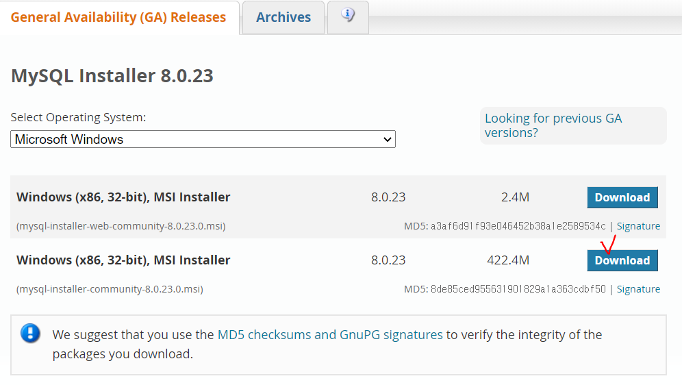
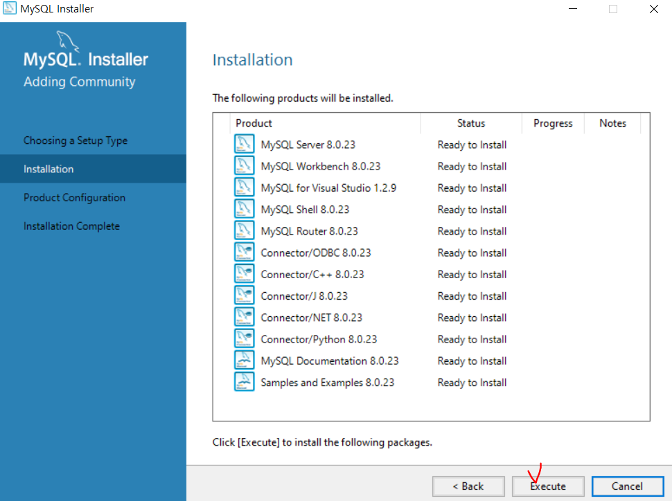
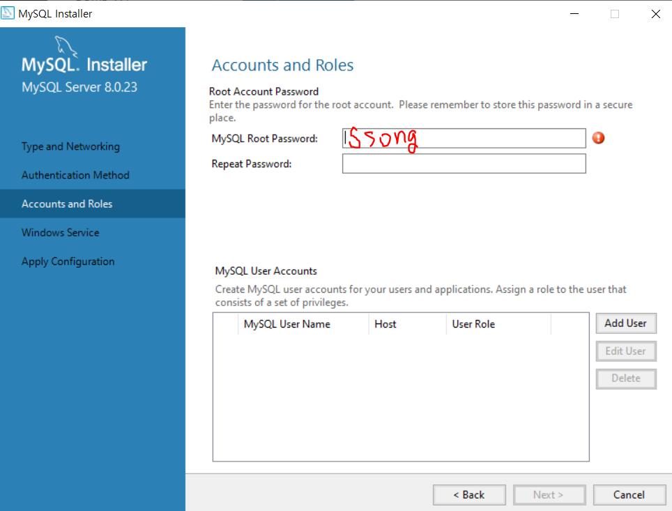
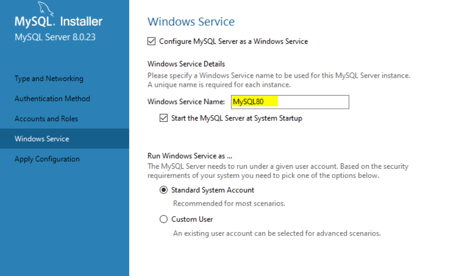
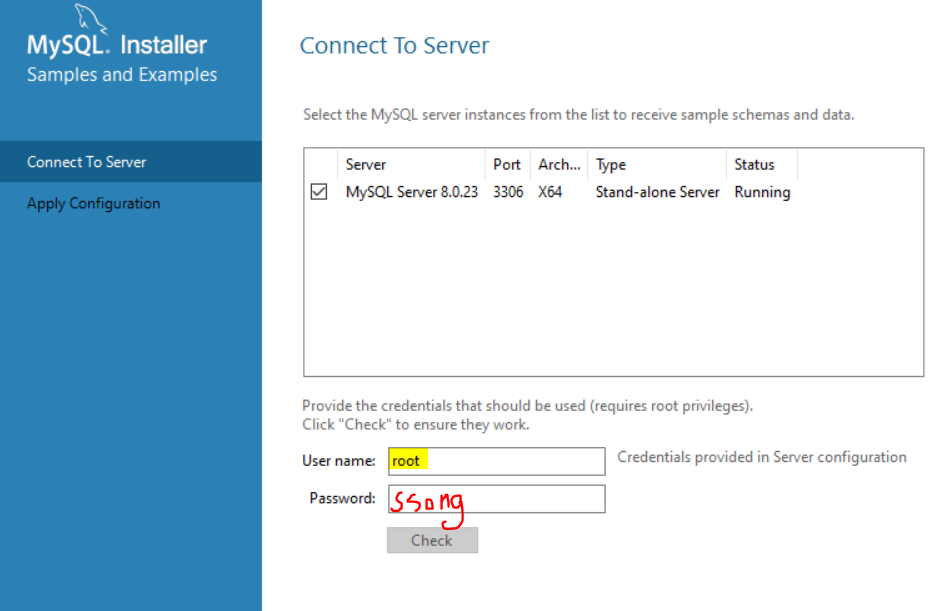
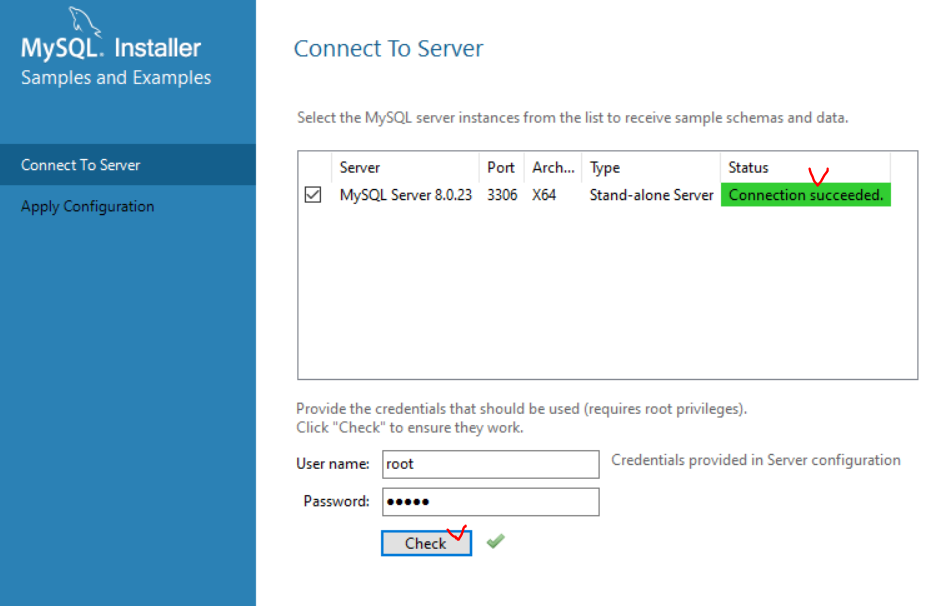
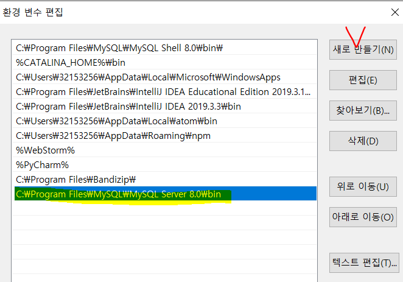
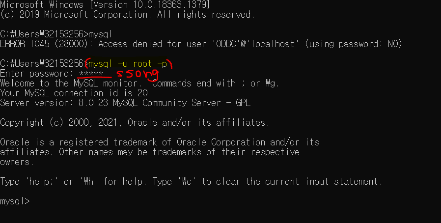
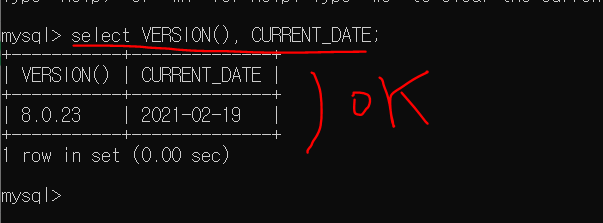

# DataBase

물리적으론 파일, 논리적으론 시스템.

데이터란?

데이터의 집합체다

여러 응용시스템들의 통합된 정보들을 저장하여 운영할 수 있는 공용데이터의 집합.

효율적으로 저장, 검색, 갱신할 수 있도록 데이터 집합들끼리 연관시키고 조직화 되어야한다.

`DBMS` : 데이터베이스 관리 시스템. 소프트웨어


> File IO와 Database의 차이

File IO : 직접 파일에 접근해서 가져오는 것.

Database : 파일을 관리하는 데이터베이스에다 명령을 내려서 시스템을 통해 파일에 간접적으로 접근하는 것.

데이터 종속성을 보완하고 중복성을 제거한다.


SQL언어는 다양하다. 그 중 우리는 `MySQL`이라는 언어로 명령을 내려서 DB를 관리할 것.


## DBMS 성질

1. 정의기능(DDL) : 건물의 영역을 구성하고 그 영역 안에 **객체**를 생성관리하는 것. (Create, Drop, Alter)
2. 조작기능(DML) : 데이터 관리 (Insert, Update, Delete) / Select(DQL,Query)
3. 제어기능(DCL) : 데이터베이스의 정확성과 안정성을 유지하도록 제어하는 기능. 권한, 트랜잭션 관련된 부분.

=> SQL문 제공되고 있다!


DBA : 데이터베이스 관리자. SQL문으로 DB를 관리하게 된다.


## 데이터베이스 종류

RDB(realations database) : 관계형 데이터 베이스. 데이터 자체를 테이블 구조로 관리하는 것.  매우 간단한 원칙의 개념의 데이터 베이스. SQL로 조작 또는 조회를 할 수 있다.

엔티티(Entity : Table), 속성으로 구성되어있다.

데이터 값이 항상 올바르게 저장 되고 관리 될 수 있도록 무결성 제약 조건들이 존재한다.

ORDB(object realations database) : 객체 관계형 데이터 베이스. 

NoSQL : SQL을 사용하지 않고 DB를 다룰 수 있는 것.


## 테이블

열 (Column) : 단일 종류의 데이터. 

행 (Row) : column들의 값의 조합. 레코드라고 불린다.


## MySQL Server설치

1. https://dev.mysql.com/downloads/windows/installer/8.0.html

해당 사이트에서 들어가 최신 MySQL로 들어간다.




2. 64bit사용하고 있지만 현재 설치하는 버전은 32bit만 제공하지만 설치해도 문제 없으니 설치!!




3. 따로 설정 줄 부분이 없어서 바로 Next - Execute를 눌러 설치한다.




4. 비밀번호는 ssong




5. 서버네임도 디폴트!






6. 서버가 잘 돌아가는지 체크!


7. C:\Program Files\MySQL\MySQL Server 8.0\bin

   mysql.exe를 누르면 시작된다!!


8. 어디서든 사용할 수 있게 환경변수에 등록하자!(편집)

   Path에 위 경로를 등록! 




9. cmd창에서 확인!



잘 돌아가면 mysql> 로 출력된다!

```bash
# -u(계정)을 root로 -p(패스워드)
mysql -u root -p
password : ssong
```


10. test




## MySQL 사용

> 예제 테이블을 추가

```mysql
mysql> create database sampleDB;
mysql> use sampleDB;

mysql>show tables; -sample
```

`mysql.txt`에 있는 sql문들을 집어넣는다

해당 파일은 C:\Users\32153256\Desktop\ssong\soltlux\TILDataBase 폴더 안에 저장해둠!


```mysql
select * from salgrade;	--5줄
select * from emp;	--4줄
select * from dept; --14줄

show tables;
3개의 테이블이 나와야한다!
```


## 실습

1. dept테이블의 모든정보를 출력

   select * from dept;

2. dept테이블에서 dname과 loc의 정보만 출력

   select dname,loc from dept;

3. Emp 테이블의 스키마 정보(어떤 컬럼들을 갖고있는지)를 알고 싶다.

   `스키마` : 어디에 사용되냐에 따라 개념이 조금씩 달라지는데 위에선 어떤 구조를 가지고있는지 확인하고 싶은 것이다.

   desc emp;


varchar는 가변데이터

char는 고정값


### Select 구문의 기본문형

> 구조

```mysql
select 출력할 결과물..컬럼의 이름
from 대상 테이블명
where 조건절, 필터링, 원하는 로우 데이터만 요청
```


`DISTINCT` 중복행을 제거

`ALIAS` 나타날 컬럼에 대한 다른 이름을 부여 =>as

`from` 선택한 컬럼이 있는 테이블을 명시시킨다.

```mysql
select job from emp; 
select distinct job from emp; 
select distinct job as 업무 from emp; 
select distinct job 업무 from emp; 

select distinct job 업 무 from emp; #error
```

공백에 의미가 크다! '무'에 대한 처리가 되지 않으므로 에러가 난다.

공백을 넣고 싶을 때 ' '(작은 따옴표)를 사용하면 된다. 

" "(큰따옴표)도 사용가능하다.

```mysql
select distinct job '업 무' from emp;
select distinct job "업 무" from emp;
```


> 문자열 결합함수 `concat`

```mysql
select concat(ename,' ',sal)
as '이름과 급여'
from emp;
```


