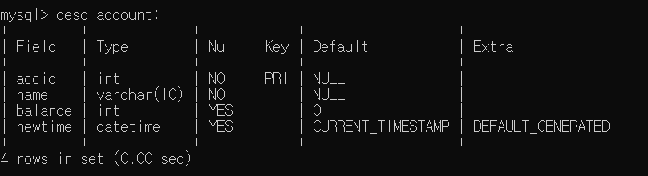
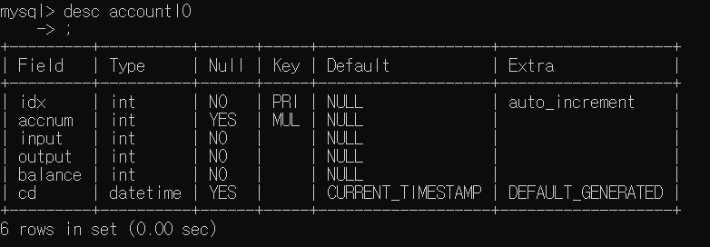

# Database

## 이클립스에서 JDBC사용

`Statement` : 일반적인 명령객체는 Statement sql을 문자열로 보내기 가장 간단한 것.

`PreparedStatement `: 가변적인 정보들 ex.회원정보

`CallaleStatement` : 프로시저를 사용할 때. 복잡한 형태의 쿼리문들은 데이터베이스에다가 함수형태로 등록시켜서 사용할 수 있음. 함수형태로 등록하는 형태를 프로시저라하는데 그를 부를때 사용한다.


## DDL

pdf 143p

> table생성

```mysql
create table 테이블명(
	필드명1 타입[null/not Null] [default] [auto_increment],
	필드명1 타입[null/not Null] [default] [auto_increment],
	필드명1 타입[null/not Null] [default] [auto_increment],
	...
    primary key(필드명)
);
```

primary key는 반드시 값을 존재해야하므로 notnull속성을 가짐. unique함.

속성값의 빈 값 허용 여부는 null 또는 not null로 설정

default키워드와 함께 입력하지 않았을 때의 초기값을 지정할 수 있다.

입력하지않고 자동으로 1씩 증가하는 번호를 위한 auto_increment


> table -컬럼 추가/ 삭제/ 수정

alter table 테이블명 add 필드명 타입 [null / not null] [default] [auto_increment];

alter table 테이블명 drop 필드명;

alter table 테이블명 change 필드명 새필드명타입 [null/not null] [default] [auto_increment];

ex)

```mysql
Member 테이블의 Primary Key no에 자동 1씨기 증가하는 속성을 추가 해 보세요.
ALTER TABLE member
 CHANGE no no INT NOT NULL AUTO_INCREMENT 
```


> table 삭제

drop table 테이블명


> table 이름변경

alter table 테이블명 rename 변경이름


## DML


한글 1byte 4byte로 쓸 수 있다. 

utf8이 나오면 유니코드를 사용하는 것. (**set names utf8**)


> 데이터 삽입

insert into 테이블명(필드1, 필드2, 필드3, 필드4,...) 

values (필드1값,필드2값,필드3값, 필드4값...)

필드명을 생략했을 경우 모든 필드값을 반드시 입력해야한다.


> 데이터 변경

update 테이블명 

\set 필드1=필드1값, 필드2=필드2값, 필드3=필드3값,...

where 조건식

특정 row값만 변경할 수 있다. 

조건식을 주지않으면 전체 row가 영향을 미치니 조심!


> 데이터 삭제

delete from 테이블명 where 조건식


## JDBC

연결방법, 필요한 것들

1. import java.sql.*;
2. 드라이버를 로드

3. connection객체

4. 명령객체

5. result객체

6. 모든 객체를 닫는다.


statement객체에는 대표적 3가지 메소드

execute("sql") < 모든 SQL이 들어감

executeQuery("sql") < select 쿼리문

executeUpdate("sql") < insert, update,delete


위의 내용들을 resultSet으로 받아온다. 인덱스는 1번부터 가능하다.

next()로 한 줄씩 읽어올 수 있다. 


## 실습

1. 테이블 생성

   1.1 계좌테이블(Account)

   ```mysql
   int accid	(pk)	
   String name	not null
   int balance	DEFAULT 0	(방법적인 부분검색)
   Calendar newtime 현재날짜/시간(설정 방법 검색)
   #-----------------------------
   
   >>쿼리문
   #1.
   create table Account (
   accid int ,
   name varchar(10) NOT NULL,
   balance	int default 0,
   newtime	datetime default current_timestamp,#now()도 가능
   PRIMARY KEY(accid)
   );
   
   #2.
   create table account(
   accid int primary key,
   name varchar(30) not null,
   balance int default 0,
   newtime datetime default now()
   );
   
   ```

   

   

   1.2 거래테이블

```mysql
create table accountio(
idx int primary key auto_increment,
accnum int,
input int not null, 
output int not null,
balance int not null, 
cd datetime default now(),
foreign key(accnum) references account(accid));
```




2. 쿼리문

   2.1 계좌 테이블 쿼리문

insert (계좌번호, 이름)

insert (계좌번호,이름, 잔액)

select (계좌번호로 검색 ->모든 정보 획득)

*---------해당 계좌가 가지고있는 잔액을 얻어와야한다-------

update (계좌번호로 찾아서 입금처리) : 기존잔액 + 입금액

update (계좌번호로 찾아서 출금처리)

delete (계좌번호로 해당 계좌 삭제)

select (모든 계좌 출력)

```mysql
insert into Account (accid, name)
values (계좌번호, 이름);

insert into account (accid,name,balance)
values (계좌번호, 이름, 잔액);

select * from where accid=계좌번호;

update account set balance=balance+입금액
where accid=계좌번호;

update account set balance=balance-출금액
where accid=계좌번호;

delete from account where accid=계좌번호;

select * from account;
```


​		2.2 거래 테이블 쿼리문

```mysql
insert into accountio(accnum,input,output,balance) 
values( 10, 1000, 0, (select balance from account where accid=10));

select * from accountio where accnum= 10;
```


### jdbc연결실습

```java
public class AccountDB {
	Connection con = null;
	Statement stmt = null;
	
	public AccountDB() throws Exception {
		try {
			Class.forName("com.mysql.jdbc.Driver");
			System.out.println("드라이버 로딩 성공");
			String dburl = "jdbc:mysql://localhost/sampleDB";
			con= DriverManager.getConnection(dburl,"root","ssong");
			System.out.println("데이터베이스 연결 성공");
			
		}catch(Exception e) {
			throw new Exception("데이터베이스 연결 오류");
			
		}
	}
}

```

오류가 났다! 왜?

=> 포트번호와 class.forname("com.mysql.cj.jdbc.Driver") 명을 지정해주지 않았다!

수정값

```java
conn = DriverManager.getConnection("jdbc:mysql://localhost:3306/sampleDB?serverTimezone=UTC","root","ssong");
			
```


commit : user가 메모리를 거쳐 DB에 저장하는 것.

rollback! 메모리에 저장되었으나 DB에 올리지않고 돌아감!


### 명령객체

Statement는 String.format("",id,등등); 을 이용해서 sql문을 조금 복잡하게 처리한다.

이 부분을 보안하는 것이 PreparedStatement

PreparedStatement는 미리 쿼리문의 포맷을 설정한다!

ex

```java
//AccountDB1.java
PreparedStatement stmt_insert = null;

BitGlobalStatement.state_Insert.setInt(1, id);
BitGlobalStatement.state_Insert.setString(2, name);
			int i= BitGlobalStatement.state_Insert.executeUpdate();


///////////////////////////////
//BitGlobalStatement.java

String Insert = "insert into account(accid,name) values(?,?);";;
			state_Insert = con.prepareStatement(Insert);

```

?(물음표)안에 설정하는 형식

rollback : commit된 위치까지 돌아가는 것.


## 팀플

저번에 만든 버스환승....테이블 설계하기

1. 중복 데이터 저장 방지! ex. 회원번호, 이름, xxxx
2. 데이터 테이블[회원, 버스], 관계 테이블[예약]