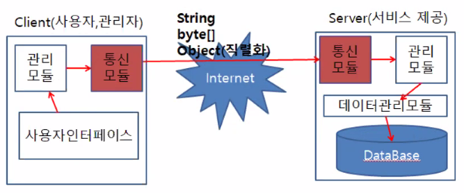

# DataBase

**TCP/IP** 프로토콜을 사용해서 이전에 작성한 계좌 관리 프로그램을 Client / Server구조로 변경하자!

Application에서의 프로토콜 정의 (직렬화 / 역직렬화)

> Day12프로젝트
> example1 패키지
> Account.java 안에서...

```java
//직렬화 : 객체 -> String -> byte[]
public byte[] example1() {
    String str = "";
    for(Account ac : accounts) {
        str += ac.getAccid() + "#";
        str += ac.getName() + "#";
        str += ac.getBalance() + "#";
        str += ac.GetDate() + "#";
        str += ac.GetTime() + "@";
    }
    System.out.println(str);

    return str.getBytes();
}

//byte[] -> String -> 객체
public void example2(byte[] buffers) {

    String str = new String(buffers);
    System.out.println(str);

    System.out.println("@를 이용하여 문자열 자르기");
    String[] filter = str.split("@");
    System.out.println("저장개수 : " + filter.length);
    try {
        for(String temp : filter) {
            System.out.println(temp);//10#홍길동#0#2021-01-22
            String[] filter1 = temp.split("#");

            int accid = Integer.parseInt( filter1[0]);
            String name = filter1[1];
            int balance = Integer.parseInt( filter1[2]);

            SimpleDateFormat formatter = new SimpleDateFormat("yyyy-MM-dd hh:mm:ss");				
            Date date = formatter.parse(filter1[3] + " " + filter1[4]);
            Calendar cal = Calendar.getInstance();
            cal.setTime(date);
            accounts1.add(new Account(accid, name, balance, cal));				
        }			
    }
    catch(Exception ex) {}

}
```


-----

## 데이터 흐름




[Client] : 사용자, 관리자

- 사용자 인터페이스 : 사용자가 원하는 것을 입력.

- 관리모듈 : 사용자 인터페이스에서 입력받은 데이터를 처리하여 통신모듈에게 전달.

- 통신모듈 : 배송 역할. 인터넷을 통해 서버의 통신모듈에게 전달한다. 


<Internet> : 클라이언트와 서버 사이, 주고 받는 데이터들을 연결해준다

기본적인 전송방법은 **byte[]** 타입, String, Object(직렬화=>자바 안에 지원해주는 객체가 있다!)


[Server] : 서비스 제공

- 통신모듈 : 배송의 역할. 정보를 적절하게 해당 위치로 전송

- 관리모듈 : 전달받은 데이터를 어떻게 처리할 것인지 처리. 데이터베이스에 요청

- 데이터 관리 모듈 : 관리모듈에게 받은 요청을 DataBase에 전달.

- DataBase


역으로 서버에서 클라이언트로 전송되기도 한다!


## TCP/IP

1대 다 통신(쓰레드) 

소켓은 1대 1통신만 가능(유니캐스팅)

< Server(서비스제공) >

[init]

Socket() : 소켓생성[전화기]

Bind() : 주소 할당[전화번호]

IP : port

Listen() : 망연결

[run - 이 아래로는 반복]

Accept() : 전화대기. 통신소켓생성. 쓰레드 생성의 역할을 맡는다. 

또 다른 소켓(통신소켓)이 만들어지게 된다.

고로 실제 대화에 참여되는 소켓(통신소캣)과 대기되는 소켓이 존재하게 된다. 

Recv() : **통신소켓**이 역할을 맡음

Send() : **통신소켓**이 역할을 맡음

[Exit]

CloseSocket() : **대기소켓**을 종료시킨다. 전화기를 없애버리는 것. 


< Client (사용자, 관리자) >

클라이언트와 서버의 TCP/IP상태는 같아야한다.

[init]

Socket() : 소켓생성[전화기] - **통신소켓**

Connect() : 전화걸기 서버의 ip : port를 알아야한다. 

통신소켓은 연결시 자동으로 주소가 할당.


잘못된 예시 설명

Recv() : Input[수동적]

Send() : Output[능동적]

둘다 기다리는 상태가 되면 데드락. 고로 반대로 능동->수동의 위치가 되어야한다.


Send() : Output[능동적]

Recv() : Input[수동적]

CloseSocket() : **대기소켓**을 종료시킨다. 전화기를 없애버리는 것. 


**여기서 사용하는 모든 함수들은 블록킹함수, 동기함수다.**

**=> 해당함수의 기능이 완료될 때 리턴되는 함수.**