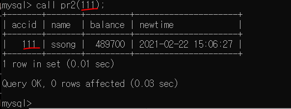
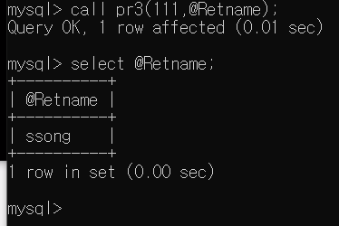

# Database

## 프로시저

데이터 베이스 안에 영구적으로 저장됨으로 계속 활용해서 사용이 가능하다.


1. 사용할 DB로 접근하기

```mysql
C:\Users\32153256>mysql -u root -p
Enter password: *****

mysql> use sampledb;
Database changed
```


2. 프로시저 등록 코드

```mysql
delimiter //
create procedure pr1()
begin
select * from account;
select * from account;#2개가 사용되는걸 볼려도 두번 넣은것
end //

delimiter ;

```


3. 프로시저 사용

```mysql
call pr1;
```


4. 인자 사용해보기

```mysql
delimiter //
create procedure pr2(id INT)
begin
select * from account where accid=id;
end //

delimiter ;
```


5. 호출

```mysql
call pr2(111);
```




## 함수

프로시저는 리턴이 없지만 함수는 리턴이 있다.

[인자사용하기 : OUT]

pr3프로시저 설명: accid값을 검색해서 이름을 얻어오는 것

```mysql
delimiter //
create procedure pr3(IN id INT,OUT retname VARCHAR(30))
begin
select name into retname from account where accid=id;
end //
#name으로 select되는 값을 retname에 넣어달라는 뜻
delimiter ;
```


```mysql
call pr3(111, @Retname);

select @Retname;
```




## 트리거

트리거(trigger)는 테이블에 대해 어떠한 처리를 실행하면 이에 반응하여 설정해 둔 명령이 자동으로 실행되는 구조를 말합니다. 이때, 이러한 과정이 총의 방아쇠를 당기는 것과 같다하여 트리거(방아쇠)라고 합니다.

insert나 update,delete 등의 명령이 실행될 때

처리를 기록하거나 만약 처리가 실패했을 때 대비해서 만들어 놓으면 좋다!

트리거를 활용하기 위해서 
Account테이블의 스키마만 복사
새로운 테이블을 생성


```mysql
create table account1 like account;

desc account1;
#복사가 되어있지만 select는 불가능. 스키마만 복사된 상태다.
```


> 트리거 작성하기

```mysql
CREATE TRIGGER 트리거_이름 BEFORE(또는 AFTER) DELETE 등의 명령
ON 테이블_이름 FOR EACH ROW
BEGIN
#변경 전(OLD.칼럼_이름) 또는 변경 후(NEW.칼럼_이름)을 이용한 처리
END

```


> 트리거 생성

```mysql
DELIMITER //
CREATE TRIGGER tr1 BEFORE DELETE ON account FOR EACH ROW	#삭제할 데이터가 있는 테이블
BEGIN
INSERT INTO account1 VALUES(OLD.accid, OLD.name, OLD.balance, OLD.newtime);	
#삭제한 데이터를 저장 테이블 – 위에서 before를 사용하므로 위를 삭제하기 전에 old데이터들을 가져와서 집어넣겠다!
END //
delimiter ;
```


> 트리거 실행 확인

```mysql
#account 테이블의 삭제처리를 해야한다!

delete from account where accid=222;

-- account1의 테이블 확인---!!
```


# Day13의 DB내용을 프로시저로 바꿔보기

## 기능


