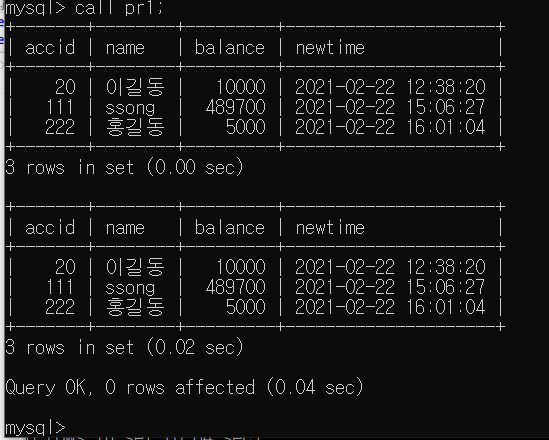

# Database

## 프로시저

1. 사용할 DB로 접근하기

```mysql
C:\Users\32153256>mysql -u root -p
Enter password: *****

mysql> use sampledb;
Database changed
```


2. 프로시저 등록 코드

```mysql
delimiter //
create procedure pr1()
begin
select * from account;
select * from account;
end //

delimiter ;

```


3. 프로시저 사용

```mysql
call pr1;
```




