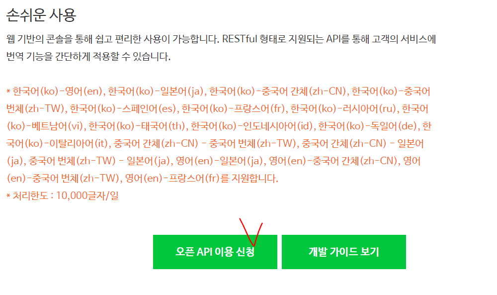

# open API 사용절차


1. key 발급
2. 사용매뉴얼확인(예제 및 JSON or XML 문서 구조 이해)
3. JSON 파싱 방법학습
4. 결과물 구현


## papago API 사용해보기

https://developers.naver.com/products/nmt/




웹서비스 URL은 현재 사용하는게 아닌 테스트니까 http://naver.com을 넣어줬다


https://developers.naver.com/docs/papago/

안에 파파고 번역 API 구현에서 JAVA파트 소스를 긁어온다


```java
import java.io.BufferedReader;
import java.io.DataOutputStream;
import java.io.InputStreamReader;
import java.net.HttpURLConnection;
import java.net.URL;
import java.net.URLEncoder;
import java.util.Map;

// 네이버 기계번역 (Papago SMT) API 예제
public class ApiExamTranslateNmt {

    public static void main(String[] args) {
        String clientId = "YOUR_CLIENT_ID";//애플리케이션 클라이언트 아이디값";
        String clientSecret = "YOUR_CLIENT_SECRET";//애플리케이션 클라이언트 시크릿값";

        String apiURL = "https://openapi.naver.com/v1/papago/n2mt";
        String text;
        try {
            text = URLEncoder.encode("안녕하세요. 오늘 기분은 어떻습니까?", "UTF-8");
        } catch (UnsupportedEncodingException e) {
            throw new RuntimeException("인코딩 실패", e);
        }

        Map<String, String> requestHeaders = new HashMap<>();
        requestHeaders.put("X-Naver-Client-Id", clientId);
        requestHeaders.put("X-Naver-Client-Secret", clientSecret);

        String responseBody = post(apiURL, requestHeaders, text);

        System.out.println(responseBody);
    }

    private static String post(String apiUrl, Map<String, String> requestHeaders, String text){
        HttpURLConnection con = connect(apiUrl);
        String postParams = "source=ko&target=en&text=" + text; //원본언어: 한국어 (ko) -> 목적언어: 영어 (en)
        try {
            con.setRequestMethod("POST");
            for(Map.Entry<String, String> header :requestHeaders.entrySet()) {
                con.setRequestProperty(header.getKey(), header.getValue());
            }

            con.setDoOutput(true);
            try (DataOutputStream wr = new DataOutputStream(con.getOutputStream())) {
                wr.write(postParams.getBytes());
                wr.flush();
            }

            int responseCode = con.getResponseCode();
            if (responseCode == HttpURLConnection.HTTP_OK) { // 정상 응답
                return readBody(con.getInputStream());
            } else {  // 에러 응답
                return readBody(con.getErrorStream());
            }
        } catch (IOException e) {
            throw new RuntimeException("API 요청과 응답 실패", e);
        } finally {
            con.disconnect();
        }
    }

    private static HttpURLConnection connect(String apiUrl){
        try {
            URL url = new URL(apiUrl);
            return (HttpURLConnection)url.openConnection();
        } catch (MalformedURLException e) {
            throw new RuntimeException("API URL이 잘못되었습니다. : " + apiUrl, e);
        } catch (IOException e) {
            throw new RuntimeException("연결이 실패했습니다. : " + apiUrl, e);
        }
    }

    private static String readBody(InputStream body){
        InputStreamReader streamReader = new InputStreamReader(body);

        try (BufferedReader lineReader = new BufferedReader(streamReader)) {
            StringBuilder responseBody = new StringBuilder();

            String line;
            while ((line = lineReader.readLine()) != null) {
                responseBody.append(line);
            }

            return responseBody.toString();
        } catch (IOException e) {
            throw new RuntimeException("API 응답을 읽는데 실패했습니다.", e);
        }
    }
}
```


## json parsing


위 라이브러리가 있어야 json파싱이 가능하다. 파일은 교수님이 주셨다.

C:\Users\32153256\Desktop\ssong\soltlux\TILDataBase

위에 설치해뒀음!!


> 설치방법


1. 해당 프로젝트 JRE에 들어가서 외부 JAR 추가


2. 선택하고 열기. 후에 apply 해주면 파싱 에러는 모두 잡을 수 있을것이당~~!

   