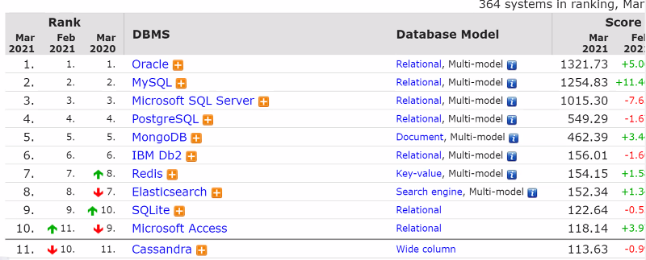

# MongoDB

javascript에서도 사용한다.

[] (bracket) : array

{} (brace) : object

<> (angle bracket) , ~ (tilde), 


## 데이터베이스 

`RDBMS` (관계형 데이터베이스) : 관계형 모델은 데이터를 행과 열로 구성된 테이블로 정규화합니다. 테이블이 존재. **Read에 최적화**

ex) MySQL

`NoSQL` (비관계형 데이터베이스) : 키-값, 문서, 그래프 등 성능과 규모 확장에 최적화된 다양한 데이터 모델을 제공합니다. json, key값과 value값을 사용. **Write에 최적화.** 

ex) MongoDB


> 용어차이


>장점

데이터 **중복 제거**

권한이 없는 접근 제한

지속적인 저장 공간과 질의 처리 공간 제공

백업과 복구 지원

여러 사용자 인터페이스 제공

데이터 사이에 다양한 관계를 효율적으로 표현

데이터 **무결성** 보장


### index

배열은 인덱스를 사용.

데이터베이스에서 인덱스란 빠른 검색을 위한 보조 자료구조.

MongoDB에도 인덱스가 존재하다. 검색속도는 빨라지지만 write속도는 떨어진다.

> 단점

연속적인 검색에 약점을 갖는다. => 연결리스트를 사용해서 보완한다.

데이터의 추가패턴에 따라 트리의 모양이 skew발생


> 인덱스를 사용해도 느려지는 경우의 해결책

=> 파티셔닝 / 샤딩


#### ❗ B-tree / B+tree

빅오 : O(logn)

B 는 balanced의 b..일거라고 추측중.

B-tree의 핵심은 데이터가 **정렬된 상태**로 유지되어 있다는 것.

B-tree는 Binary search tree와 유사하지만, 한 노드 당 자식 노드가 2개 이상 가능하다. 

key 값을 이용해 찾고자 하는 데이터를 트리 구조를 이용해 찾는 것이다.

B-tree 처음 생성 당시는 균형 트리이지만 테이블 갱신(INSERT/UPDATE/DELETE)의 반복을 통해 서서히 균형이 깨지고, 성능도 악화된다. 


> b-tree 장점

어떤 값에 대해서도 같은 시간에 결과를 얻을 수 있다 인데, 이를 '균일성'이라고 한다. 


> 해시와 B-tree

해시는 한번에 검색가능. 데이터가 많아지면 충돌현상. 검색이 한번 아니고 여러번일어나게됨.

B-tree는 여러번 비교하나 데이터가 많아져도 문제가 없다. 하지만 느려진다(비교회수가 증가)


- B+tree

B-tree의 확장개념으로, **B-tree의 경우**, internal 또는 branch 노드에 key와 data를 담을 수 있다. 하지만, **B+tree의 경우** 브랜치 노드에 key만 담아두고, data는 담지 않는다. 오직 리프 노드에만 key와 data를 저장하고, 리프 노드끼리 Linked list로 연결되어 있다. 


> 장점

1. 리프 노드를 제외하고 데이터를 담아두지 않기 때문에 메모리를 더 확보함으로써 더 많은 key들을 수용할 수 있다. 하나의 노드에 더 많은 key들을 담을 수 있기에 트리의 높이는 더 낮아진다. (cache hit를 높일 수 있음)

2. 풀 스캔 시, B+tree는 리프 노드에 데이터가 모두 있기 때문에 한 번의 선형탐색만 하면 되기 때문에 **B-tree에 비해 빠르다.** B-tree의 경우에는 모든 노드를 확인해야 한다. 


## 정형, 반정형, 비정형

정형(Structured Data) - RDBMS / XML

: 스키마와 주민번호 같은것.

정형 데이터는 그 값이 의미를 파악하기 쉽고, 규칙적인 값으로 데이터가 들어갈 경우 정형 데이터라고 인식하면 될 것이다.


반정형(semi-structured data)

: 스키마리스(약간의 자유도), NoSQL(Json)

전한 정형이 아니라 약한 정형 데이터라는 것이다. 대표적으로 HTML이나 XML과 같은 포맷을 반정형 데이터의 범위에 넣을 수 있을 것이다. 일반적인 데이터 베이스는 아니지만 스키마를 가지고 있는 형태이다.

테이블 외래키 연결구조가 아님. 조인도 안됨.

출처: https://needjarvis.tistory.com/502 [자비스가 필요해]

- Object embedding : 


비정형(un-structured data)

: 동영상, 텍스트(웹페이지)

정해진 규칙이 없어서 값의 의미를 쉽게 파악하기 힘든 경우이다. 흔히, 텍스트, 음성, 영상과 같은 데이터가 비정형 데이터 범위에 속해있다.

출처: https://needjarvis.tistory.com/502 [자비스가 필요해]


## RDBMS의 특징

테이블이 여러개로 나눠진 상태에서 원하는 데이터를 찾으려면 테이블을 합쳐서(JOIN) 필요한 데이터검색.

관계의 집합으로 구성된 데이터베이스


> 트랜잭션의 4대특성

A(원자성) - commit/ rollbank. 관련 작업들이 부분적으로 실행되다가 중단되지 않는 것을 보장하는 능력이다. 모두 수행되거나 하나도 수행되지 않아야한다.

C(일관성) - 여러개의 클라이언트가 조회해도 데이터가 항상 일정

I(고립성,격리성) - 트랜잭션은 다른 트랜잭션이 동작하고 있지 않은 경우에만 수행되어야한다.

D(지속성,내구성) - 일단 트랜잭션이 완료되면 그 결과는 유실되어서는 안된다!


트랜잭션 : 데이터베이스의 상태를 변화시키는 하나의 


## JSON

- 외래키 개념이 존재하지 않는다. 

- 중첩(nesting) 이 가능. 오브젝트, 배열.

ex)

{ 

"name" : "songwon",

"age" : 25,

"hobby": ["painting","swimming"]

}


- 웹쪽에서는 JSON을 사용하고 설정, 셋팅에는 **YAML(야무)**를 주로 사용한다.

- File, Stream -> 1차원 자료구조

- disk를 많이 차지않다.


OOP(Object - oriented Program) : 객체 지향 프로그램 

vs

Function - oriented : 함수 지향 프로그램. ex. C계열


javascript는 oop가 아니고 object-based이다.

TCP (connection -oriented) vs UDP(connection-less)


## 데이터베이스 전체

- RDBMS
  - VLDB(샤딩/파티셔닝/복제) : 순수한 RDB는 아니다.

- NoSQL

- BigData

- 검색엔진


db-engines.com 이라는 사이트가 있는데 여기서 db사용률 및 랭킹을 확인해 볼 수 있다. 

현재 (21.03.02) Oracle이 1위.




## MongoDB 설치

https://velopert.com/436

여기서 참고 하기


https://www.mongodb.com/try/download/community


1. 위에 들어가서 다운받기
2. 다른거 바꿀거없이 next 해서 설치하기


CMD 창을 열어서 디렉토리로 들어가 `mongod`를 실행하면 서버가 실행됩니다.

```bash
Microsoft Windows [Version 10.0.18363.1379]
(c) 2019 Microsoft Corporation. All rights reserved.

C:\Users\Velopert>cd C:\Program Files\MongoDB\Server\4.4\bin

C:\Program Files\MongoDB\Server\4.4\bin>mkdir C:\data\db

C:\Program Files\MongoDB\Server\4.4\bin>mongod
```


mysql-server / mysql-client

mongo(server) / mongo(client)


daemon(server)

ftpd / apached

GUI vs CLI(Command-line interface)

Mongo는 GUI로 구성되어있다


### 실행


1. 접속을 하면 Create Collection 눌러서 콜렉션을 생성한다.


2. sample 생성을 확인했으면 sample을 누르면 ADD DATA활성화를 볼 수 있음!

   


3. 위와 같이 뜨는 것을 확인! 오늘은 여기까지만!!


