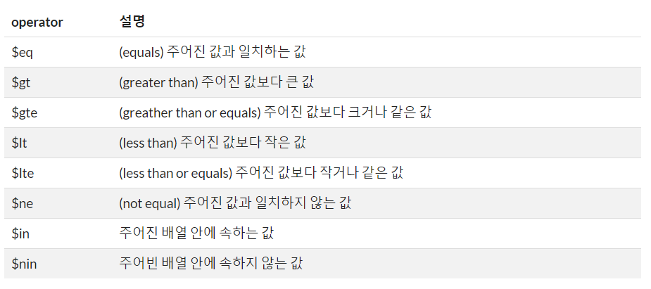
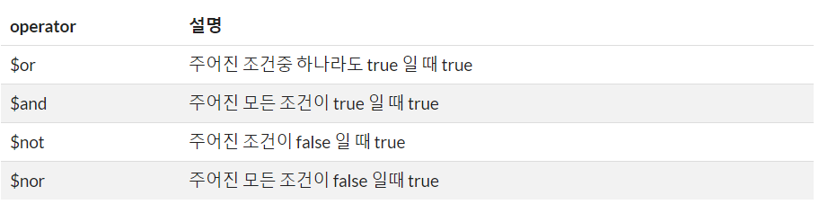
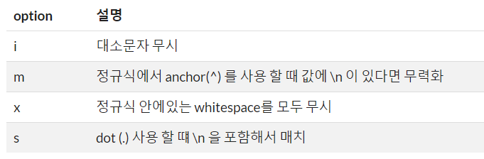

## version설명

CE(Community Edition) - 오픈소스기반

EE(Enterprise Edtion) - CE+고급기능추가

> Open Sources 버전 표시

Edge (alptha버전), Stable (beta버전), LTS (정식버전) / GA(Generally Available)


OS를 제외한 제일 큰 오픈소스 = 웹브라우저 ex. chrome(8 core 인스턴스)

크롬은 오픈소스인가? => X

chromium - open source(0), chrome - open source(X), edge


## mysqldump(mysql업뎃할때) vs Enterprise Backup vs innodbbackup

mysqldump : 백업이 시작되면 멈출 수 없음

fork : create process

MySQL : mariaDB의 사촌격/ perconaDB


> MySQL Storage Engine

*MyISAM vs InnoDB

MyISAM(원조) - 외래키 지원X , 트랜잭션 X

InnoDB(요즘 기본) - 외래키 지원 O, 트랜잭션 O

*트랜잭션 : 데이터베이스의 상태를 변환시키는 하나의 논리적 기능을 수행하기 위한 작업의 단위 또는 한꺼번에 모두 수행되어야 할 일련의 연산들을 의미한다.


MariaDB를 쓰는 이유

더 빨라서(MySQL) 5~7%

라이센스

유료기능


# MongoDB

## 사용법


지정된 포트번호가 있다.

ex)

Oracle		1521

MySQL		3306

MongoDB	27017


collection을 table로 document를 record로 생각하면 편하다.

> MySQL의 예시

```mysql
create database sample;
show databases;
use sample;
show tables;
create table xxxx;

desc xxxx;
show create table xxxx;

select * from xxxx;
```


## 짜뚜리

Front-end <- 통신(HTTP) -> Back-end(DBMS/Server)

전용프로토콜(통신규약, CRUD가능) vs HTTP GET/POST


HTTP는 CRUD를 사용할수가 없어서 확장판을 지원하게 되었다! => REST

명령어 포맷 XML => JSON

즉 JSON/REST로 통신한다.


쿠팡이 요즘 뜨고있는 이유! 

미국에 주식상장 및

**Spring Cloud, Spring Boot2 -> MSA(Micro-service Architecture)**

위의 기술이 합쳐져있음.


몽고에서는 저장프로시저를 javascript로 작성. DBMS에서 stored procedure / trigger(저장프로시저/트리거)

최적화엔진이 DBMS이 있음


`MSA` = Microservices architecture

**하나의 큰 어플리케이션을 여러개의 작은 어플리케이션으로 쪼개어 변경과 조합이 가능하도록 만든 아키텍쳐"**


> 책내용

```mongoDB
>db.createCollection("emp",{chapped:false,size:8192});
{"ok",1}

>show collections
emp

>db.emp.renameCollection("employees")	#해당 콜렉션 이름변경
>db.employees.drop();	#해당 콜렉션 삭제
```


InfluxDB : 이력(Time series, log같은것...?)을 관리하는 DB

candle graph : 하루에 올라가는 주가의 최저 최고, 시가 종가를 알려주는 그래프

mysql> set autocommit=0; #1줄씩 실행 후 바로 커밋

mysql> show variables like '%commit%';

---


### transacion Isolation level 

transacion Isolation level : 트랙잭션 격리성레벨. 트랜잭션 처리 시 다른 트랜잭션에서 접근해 자료를 수정하거나 볼 수 있도록 하는 수준입니다.

*Lock : 테이블에서 작업을 하는 동안 해당 작업을 하는 테이블들은 Lock이 걸린다. 

1. read committed : COMMIT 된 데이터에 다른 트랜잭션에서 접근할 수 있다. 커밋이 나가기전 마지막 커밋값만 인정. 구현방식의 차이때문에 Query를 수행한 시점의 데이터와 정확하게 일치하지 않을 수 있다. Lock이 발생하지 않는다.
2. read uncommitted :  INSERT, UPDATE, DELETE 후 COMMIT 이나 ROLLBACK에 상관없이 현재의 데이터를 읽어온다. rollback이 될 데이터도 읽어올 수 있으므로 주의가 필요하다! Lock이 발생하지 않는다.
3. repeatable read : **default level** SELECT시 현재 시점의 스냅샷을 만들고 스냅샷을 조회한다. record lock과 gap lock이 발생한다. CREATE SELECT, INSERT SELECT시 lock이 발생한다.
4. serializable : 가장 강력한 LEVEL이다. SELECT 문에 사용하는 모든 테이블에 shared lock이 발생한다.


- 시간이 많이 걸리는 트랜잭션

=> 백업/복제

중간에 값이 달라지는 것을 체크할 것인가?


### ACID

원자성 : 모든 작업이 반영되거나 모두 롤백되는 특성

일관성 : 데이터는 미리 정의된 규칙에서만 수정이 가능한 특성을 의미합니다. 숫자칼럼에 문자열값을 저장이 안되도록 보장해줍니다.

격리성 :A와 B 두개의 트랜젝션이 실행되고 있을 때, A의 작업들이 B에게 보여지는 정도를 의미합니다.

영구성 :한번 반영(커밋)된 트랜젝션의 내용은 영원히 적용되는 특성을 의미합니다.


## 실행

MongoDB, MySQL과 같은 것의 실행속도를 확인할려면 데이터베이스에선 `explain`을 적으면 속도를 볼 수 있다.


https://velopert.com/457

2탄부터 따라서 해보자!

MongoDB01.md에서 sampleDB를 만들어놨다.


아래의 Beta를 누르면 터미널창이 뜬다

1. mongodb_tutorial만들기. create를 하지 않아도 use로 생성이 가능하다!

   리스트에는 나오지 않는다!

   why=> 내용이 담겨있지않기 때문에

```bash
use mongodb_tutorial
```


2. 데이터 넣기

```mysql
db.book.insert({"name": "MongoDB Tutorial", "author": "velopert"});
```

>결과


show 로 확인해보면 database와 collection이 만들어진것을 확인 할 수 있다.


> 예제해보기

```mysql
use test;

db.createCollection("books");

db.createCollection("articles",{capped:true,autoIndexId:true,size:6142800,max:10000});

db.people.insert({"name": "velopert"});

#확인용
show collections;
```


```mysql
#삽입
db.books.insert({"name": "NodeJS Guide", "author": "Velopert"});

#삽입
db.books.insert([
{"name": "Book1", "author": "Velopert"},
{"name": "Book2", "author": "Velopert"}
]);

#확인용
db.books.find();

#확인용
db.books.find({"name": "Book1"});

#제거
db.books.remove({"name": "Book1"});

#확인용
db.books.find();
```


오브젝트가 여러개 중첩되어있는 상태 : Object Embedding


```json
[
  {
    "title": "article01",
    "content": "content01",
    "writer": "Velopert",
    "likes": 0,
    "comments": []
  },
  {
    "title": "article02",
    "content": "content02",
    "writer": "Alpha",
    "likes": 23,
    "comments": [
      {
        "name": "Bravo",
        "message": "Hey Man!"
      }
    ]
  },
  {
    "title": "article03",
    "content": "content03",
    "writer": "Bravo",
    "likes": 40,
    "comments": [
      {
        "name": "Charlie",
        "message": "Hey Man!"
      },
      {
        "name": "Delta",
        "message": "Hey Man!"
      }
    ]
  }
]
```


## CRUD

> insert

```mysql
>db.emp.insert({eno:1101,fname:"JIMMY"});
==>insert into emp(eno,fname) values(1101,"JIMMY");
```

> update

```mysql
>db.emp.update({eno:1101},{$set:{fname:"Joo"}});
==> update emp set fname="Joo" where eno=1101;
$set:{A:B} : A의 담긴내용을 B로 값을 바꾸는것
```

> delete

```mysql
>db.emp.remove({eno:1101});
==> delete from emp where eno=1101;
```

> select

```mysql
>db.emp.find({},{empno:1,ename:1}); 
key-value구조를 맞추기 위해 1을 넣는 것이다
==>select empno, ename from emp;

>db.emp.find({eno:3});
==> select * from emp where eno=3;

>db.emp.find({eno:3},{empno:1,ename:1});
==> select empno,ename from emp where eno=3;

>db.emp.sort({eno:-1});
eno기준으로 내림차순
==> select * from emp order by eno desc;
```


## 비교연산자

**$gt : 이상(>), $lt : 미만(<)**
**$gte : (>=) ,$lte : (<=)**



shell script에서도 위와같은 표현사용.

> 예제

```mysql
#예제5: likes 값이 10보다 크고 30보다 작은 Document 조회
db.articles.find( { "likes": { $gt: 10, $lt: 30 } } ).pretty();

#예제6: writer 값이 배열 [“Alpha”, “Bravo”] 안에 속하는 값인 Document 조회
db.articles.find( { "writer": { $in: [ "Alpha", "Bravo" ] } } ).pretty();
```


## 논리연산자



>예제

```mysql
#예제7: title 값이 “article01” 이거나, writer 값이 “Alpha” 인 Document 조회
db.articles.find({ $or: [ { "title": "article01" }, { "writer": "Alpha" } ] });

#예제8: writer 값이 “Velopert” 이고 likes 값이 10 미만인 Document 조회

db.articles.find( { $and: [ { "writer": "Velopert" }, { "likes": { $lt: 10 } } ] } );

#이렇게도 가능합니다
db.articles.find( { "writer": "Velopert", "likes": { $lt: 10 } } );
```


## 그외 연산자

**$regex** 

$regex 연산자를 통하여 Document를 정규식을 통해 찾을 수 있습니다. 

> 기본예제

```mysql
{ <field>: { $regex: /pattern/, $options: '<options>' } }
{ <field>: { $regex: 'pattern', $options: '<options>' } }
{ <field>: { $regex: /pattern/<options> } }
{ <field>: /pattern/<options> }
```

4번째줄처럼 $regex를 작성하지 않고 바로 정규식을 쓸 수 도 있습니다.


> 옵션




```mysql
#예제09: 정규식 article0[1-2] 에 일치하는 값이 title 에 있는 Document 조회

db.articles.find( { "title" : /article0[1-2]/ } );
```


**$where** 

$where 연산자를 통하여 javascript expression을 사용할 수 있습니다.

```mysql
#예제09: 정규식 article0[1-2] 에 일치하는 값이 title 에 있는 Document 조회

db.articles.find( { $where: "this.comments.length == 0" } );
```


**$elemMatch**

$elemMatch 연산자는 Embedded Documents 배열을 쿼리할때 사용됩니다. 저희 mock-up data 에서는 comments 가 Embedded Document에 속합니다.

```mysql
#예제11: comments 중 “Charlie” 가 작성한 덧글이 있는 Document 조회

db.articles.find( { "comments": { $elemMatch: { "name": "Charlie" } } } );
```


```mysql
{
    "username": "velopert",
    "name": { "first": "M.J.", "last": "K."},
    "language": ["korean", "english", "chinese"]
  }
```


만약 스키마의 상황이 위와 같다면 다음과 같이 쿼리한다.

```mysql
db.users.find({ "name.first": "M.J."});
```

Document의 배열이아니라 그냥 배열일 시에는 다음과 같이 Query한다.

```mysql
db.users.find({ "language": "korean"});
```


## Projection

find() 메소드의 두번째 parameter 인 projection

결과값에서 보여질 field를 정하는 것.

```mysql
#예제12: article의 title과 content 만 조회

db.articles.find( { } , { "_id": false, "title": true, "content": true } );
```


**$slice연산자**

$slice 연산자는 Embedded Document 배열을 읽을때 limit 설정을 합니다.

```mysql
#예제13: title 값이 article03 인 Document 에서 덧글은 하나만 보이게 출력

db.articles.find( { "title": "article03" }, { comments: { $slice: 1 } } );
```


$elemMatch연산자

```mysql
#예제14:  comments 중 “Charlie” 가 작성한 덧글이 있는 Document 중 제목, 그리고 Charlie의 덧글만 조회

db.articles.find(
     {
         "comments": {
             $elemMatch: { "name": "Charlie" }
         }
     },
     {
         "title": true,
         "comments": {
             $elemMatch: { "name": "Charlie" }
         },
         "comments.name": true,
         "comments.message": true
     }
);
```

