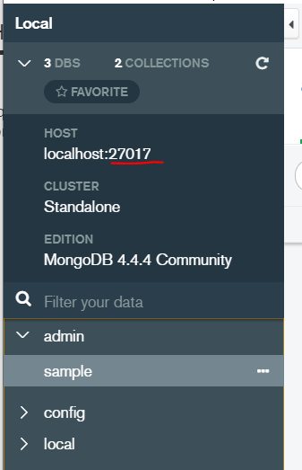
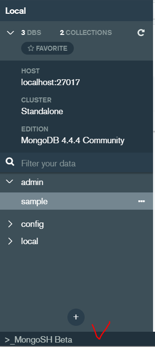
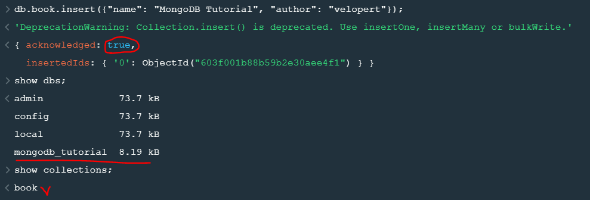

## version설명

CE(Community Edition) - 오픈소스기반

EE(Enterprise Edtion) - CE+고급기능추가

> Open Sources 버전 표시

Edge (alptha버전), Stable (beta버전), LTS (정식버전) / GA(Generally Available)


OS를 제외한 제일 큰 오픈소스 = 웹브라우저 ex. chrome(8 core 인스턴스)

크롬은 오픈소스인가? => X

chromium - open source(0), chrome - open source(X), edge


## mysqldump(mysql업뎃할때) vs Enterprise Backup vs innodbbackup

mysqldump : 백업이 시작되면 멈출 수 없음

fork : create process

MySQL : mariaDB의 사촌격/ perconaDB


> MySQL Storage Engine

*MyISAM vs InnoDB

MyISAM(원조) - 외래키 지원X , 트랜잭션 X

InnoDB(요즘 기본) - 외래키 지원 O, 트랜잭션 O

*트랜잭션 : 데이터베이스의 상태를 변환시키는 하나의 논리적 기능을 수행하기 위한 작업의 단위 또는 한꺼번에 모두 수행되어야 할 일련의 연산들을 의미한다.


MariaDB를 쓰는 이유

더 빨라서(MySQL) 5~7%

라이센스

유료기능


# MongoDB

## 사용법



지정된 포트번호가 있다.

ex)

Oracle		1521

MySQL		3306

MongoDB	27017


collection을 table로 document를 record로 생각하면 편하다.

> MySQL의 예시

```mysql
create database sample;
show databases;
use sample;
show tables;
create table xxxx;

desc xxxx;
show create table xxxx;

select * from xxxx;
```


## 짜뚜리

Front-end <- 통신(HTTP) -> Back-end(DBMS/Server)

전용프로토콜(통신규약, CRUD가능) vs HTTP GET/POST


HTTP는 CRUD를 사용할수가 없어서 확장판을 지원하게 되었다! => REST

명령어 포맷 XML => JSON

즉 JSON/REST로 통신한다.


쿠팡이 요즘 뜨고있는 이유! 

미국에 주식상장 및

**Spring Cloud, Spring Boot2 -> MSA(Micro-service Architecture)**

위의 기술이 합쳐져있음.


몽고에서는 저장프로시저를 javascript로 작성. DBMS에서 stored procedure / trigger(저장프로시저/트리거)

최적화엔진이 DBMS이 있음


`MSA` = Microservices architecture

**하나의 큰 어플리케이션을 여러개의 작은 어플리케이션으로 쪼개어 변경과 조합이 가능하도록 만든 아키텍쳐"**


> 책내용

```mongoDB
>db.createCollection("emp",{chapped:false,size:8192});
{"ok",1}

>show collections
emp

>db.emp.renameCollection("employees")	#해당 콜렉션 이름변경
>db.employees.drop();	#해당 콜렉션 삭제
```


## CRUD

> insert

```mysql
>db.emp.insert({eno:1101,fname:"JIMMY"});
==>insert into emp(eno,fname) values(1101,"JIMMY");
```

> update

```mysql
>db.emp.update({eno:1101},{$set:{fname:"Joo"}});
==> update emp set fname="Joo" where eno=1101;
$set:{A:B} : A의 담긴내용을 B로 값을 바꾸는것
```

> delete

```mysql
>db.emp.remove({eno:1101});
==> delete from emp where eno=1101;
```

> select

```mysql
>db.emp.find({},{empno:1,ename:1}); 
key-value구조를 맞추기 위해 1을 넣는 것이다
==>select empno, ename from emp;

>db.emp.find({eno:3});
==> select * from emp where eno=3;

>db.emp.find({eno:3},{empno:1,ename:1});
==> select empno,ename from emp where eno=3;

>db.emp.sort({eno:-1});
eno기준으로 내림차순
==> select * from emp order by eno desc;
```


**$gt : 이상(>), $lt : 미만(<)**
**$gte : (>=) ,$lte : (<=)**

shell script에서도 위와같은 표현사용.


MongoDB, MySQL과 같은 것의 실행속도를 확인할려면 데이터베이스에선 `explain`을 적으면 속도를 볼 수 있다.


## 실행


https://velopert.com/457

2탄부터 따라서 해보자!

MongoDB01.md에서 sampleDB를 만들어놨다.




아래의 Beta를 누르면 터미널창이 뜬다

1. mongodb_tutorial만들기. create를 하지 않아도 use로 생성이 가능하다!

   리스트에는 나오지 않는다!

   why=> 내용이 담겨있지않기 때문에

```bash
use mongodb_tutorial
```


2. 데이터 넣기

```mysql
db.book.insert({"name": "MongoDB Tutorial", "author": "velopert"});
```

>결과



show 로 확인해보면 database와 collection이 만들어진것을 확인 할 수 있다.


> 예제해보기

```mysql
use test;

db.createCollection("books");

db.createCollection("articles",{capped:true,autoIndexId:true,size:6142800,max:10000});

db.people.insert({"name": "velopert"});

#확인용
show collections;
```


```mysql
#삽입
db.books.insert({"name": "NodeJS Guide", "author": "Velopert"});

#삽입
db.books.insert([
{"name": "Book1", "author": "Velopert"},
{"name": "Book2", "author": "Velopert"}
]);

#확인용
db.books.find();

#확인용
db.books.find({"name": "Book1"});

#제거
db.books.remove({"name": "Book1"});

#확인용
db.books.find();
```


오브젝트가 여러개 중첩되어있는 상태 : Object Embedding


```json
[
  {
    "title": "article01",
    "content": "content01",
    "writer": "Velopert",
    "likes": 0,
    "comments": []
  },
  {
    "title": "article02",
    "content": "content02",
    "writer": "Alpha",
    "likes": 23,
    "comments": [
      {
        "name": "Bravo",
        "message": "Hey Man!"
      }
    ]
  },
  {
    "title": "article03",
    "content": "content03",
    "writer": "Bravo",
    "likes": 40,
    "comments": [
      {
        "name": "Charlie",
        "message": "Hey Man!"
      },
      {
        "name": "Delta",
        "message": "Hey Man!"
      }
    ]
  }
]
```

