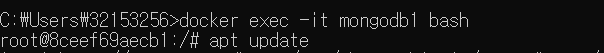
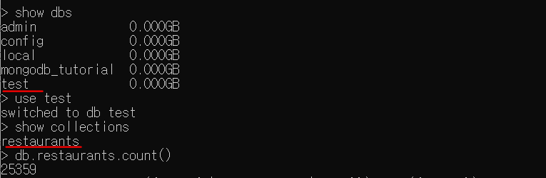

# 짜투리

갤S9에 캡쳐해뒀음

JDBC - wrapper(래퍼)
  Java - JDBC connector - MySQL

  부가가치(WAS/middleware)

  Spring Framework+WAS
    WAS(middleware)
    Framework/Engine

  Front-end/Back-end(금융권)
  Client-Server(C/S)

1-tier 
  Java(DBMS Client) - MySQL(DBMS Server)
2-tier
  Web Browser - WebServer/JSP(DBMS Client) - MySQL(DBMS Server)
  cf. Web Server(Apache/Nginx)/Tomcat
3-tier
  Web Browser - WebServer/JSP(WAS Client) - WAS(Server/DBMS client) - MySQL(DBMS Server)
N-tier 

  부가가치(트랜잭션/장애대응, 신뢰성)
   - DBMS에서 트랜잭션 보장가능? 한계
   - DBMS외부에서 트랜잭션을 보장할 필요(BEA cf. EMC)
       Middleware BEA Tuxedo(C)
       WAS        BEA Weblogic(Java) / Tmax JEUS

  Dell - EMC(Storage Server) - VMWare - Spring Framework
    Server    

  Spring Framework(API) + WAS

  IT/ICT(주식시장) cf. Brics/Chindia, Bio/BT
  FAANG / AMIG(AWS, Azure, Bluemix, Google)


WSL = windows subsystem for linux

윈도우OS는 점유율이 95~97%

개발자는 주로 윈도우 개발을 하면서 리눅스의 점유율이 엄청 낮아졌음.


# Docker 설치

https://www.docker.com/products/docker-desktop

1. 위의 페이지에서 Windows버전으로 설치한다.

2. 설치 후 리부트

3. wsl2설치가 필요하다는 말이 뜬다.


https://docs.microsoft.com/ko-kr/windows/wsl/install-win10#step-4---download-the-linux-kernel-update-package

위에서 wsl2를 설치!

4. wsl2를 설치 후에 위에서 Restart를 해야한다!!!!

5. restart를 누르고 아래와 같이 docker가 실행되면 된다!

   

오른쪽에 시스템 트레이에 (시계오른쪽 말풍선모양) "docker is starting"이라는 메세지가 뜬다.


6. docker설치 확인법. cmd에 docker라고 쳤을때 아래와 같이 뜬다.


## ubuntu/centOS 설치

7. 우분투 실행하기

   ```bash
   docker run -it --name=ubuntu1 ubuntu
   ```

   

#이후 부터는 우분투 환경인것!


8. 우분투활용해보기

```bash
#리눅스 버전 확인
uname -a
#우분투 버전 확인
cat /etc/issue
```


9. 컨테이너 탈출하는 법

=> ctrl을 누른상태에서 P와 Q를 연달아 누른다!


10. 다른 버전 우분투 띄우기(18.04버전)

```bash
docker run -it --name=ubuntu2 ubuntu:18.04
#위에서 ubuntu1에 접속했으므로!

uname -a
cat /etc/issue
#위의 명령어들로 확인할 수 있다!
```


11. centOS 설치하기(설치하기전 ctrl+P+Q로 탈출!)

```bash
docker run -it --name=centos1 centos

#리눅스버전확인
uname -a
#centos버전확인
cat /etc/centos-release
```


## 리눅스에 mysql설치


1. mysql을 리눅스에 설치해보자!

```bash
docker run -d -p 3306:3306 -e MYSQL_ROOT_PASSWORD=ssong --name=mysql1 mysql
```

비밀번호는 내 mysql 비번을 쓰면됨!


앗! 3306은 윈도우에서 쓰고있는 포트번호라 충돌이 났다! 

3307포트로 다시 다운받자!

```bash
docker run -d -p 3307:3306 -e MYSQL_ROOT_PASSWORD=ssong --name=mysql2 mysql:5.7
```

위 명령어를 치면 방화벽설치문구가 뜬다! OK누르고 다음으로 넘어간다.


설치성공!


2. 컨테이너 접속

```bash
docker exec -it mysql2 bash
```


3. mysql접속

```bash
mysql -uroot -p
```


## 오픈소스기반 테스트 DB(MariaDB)

https://launchpad.net/test-db

1. 위의 사이트에 가서 다운로드 2번째파일을 가져오기.


https://launchpad.net/test-db/employees-db-1/1.0.6/+download/employees_db-full-1.0.6.tar.bz2

2. 위의 두번째 다운로드 링크주소이다.(우클릭 - 링크주소복사 한것)


3. 순서대로 #상태에서 설치받기(가상머신상태)

```bash
apt update

apt install nano

apt install wget

apt install bzip2

#설치
wget https://launchpad.net/test-db/employees-db-1/1.0.6/+download/employees_db-full-1.0.6.tar.bz2

#압축해제
bzip2 -d employees_db-full-1.0.6.tar.bz2
tar xvf employees_db-full-1.0.6.tar

cd employees_db
ls
```


4. 해당 위치에서 mysql 접속하기

```bash
root@ee1f76716d75:/employees_db# mysql -uroot -p

#sql소스 복원하기
mysql>source employees.sql
```


## 트랜잭션 사용

1.트랜잭션을 쓰기 위한 준비

```bash
set autocommit=0;
```


2. test 레코드를 하나 넣어보자.

```mysql
insert into employees values (100,'2000-1-1','Seokjae','Ha','M','2021-3-1');


CREATE TABLE `employees_new` (
  `emp_no` int(11) NOT NULL,
  `birth_date` date NOT NULL,
  `first_name` varchar(14) NOT NULL,
  `last_name` varchar(16) NOT NULL,
  `gender` enum('M','F') NOT NULL,
  `hire_date` date NOT NULL,
  PRIMARY KEY (`emp_no`),
  KEY `sample_index` (`first_name`,`last_name`)
) ENGINE=InnoDB DEFAULT CHARSET=latin1;
```


DML(레코드 CRUD)은 rollback 가능.

DDL(schema CRUD)은 rollback이 안된다.

따로 설정하지 않으면 **InnoDB**가 기본!


## MongoDB연결하기

```bash
#mongo받기
C:\Users\32153256>docker run -d -p 27017:27017 --name mongodb1 mongo
#실행
C:\Users\32153256>docker exec -it mongodb1 bash
#mongo실행
root@8ceef69aecb1:/# mongo
```

실행하고 나서 show dbs를 해보면 어제 docker에서 확인했던것과 같이 뜨는 것을 확인할 수 있다!


## mongo에 JSON받기




1. mongodb1을 실행시킨다

2. json을 받기 위해 오픈소스를 받았던 것처럼 #상태에서 시작한다.

```mysql
# apt update
# apt install nano
# apt install wget
# wget https://raw.githubusercontent.com/mongodb/docs-assets/primer-dataset/primer-dataset.json
# nano primer-dataset.json
```

JSON - MongoDB import
https://m.blog.naver.com/PostView.nhn?blogId=korn123&logNo=220864724172&proxyReferer=https:%2F%2Fwww.google.com%2F

3. json까지 모두 받으면 몽고를 실행해보자!

```mysql
# /usr/bin/mongoimport --db test --collection restaurants --drop --file primer-dataset.json
# mongo
```

```mysql
> show dbs
> use test
> show collections
> db.restaurants.count()
> db.restaurants.find({name:{"$exists":true, $ne:""}}).sort({name:1})

```



위에서 test 데이터베이스에 받은 레스토랑 콜렉션을 확인할 수 있다.


### 예제

```mysql
#이름이 null이 아닌 레코드 조회, 이름에 대해 오름차순으로 정렬
> db.restaurants.find({name:{"$exists":true, $eq:""}}).count()

#이름이 없는 가게 카운트 조회, 이름에 대해 오름차순으로 정렬
> db.restaurants.find({name:{"$exists":true, $eq:""}}).sort({name:1}).count()

#bagel 가게 리스트 중에 오름차순으로 정렬, /문자열/ => 와일드카드와 역할 비슷하다.
> db.restaurants.find({cuisine:/Bagels/}).sort({name:1})

#중복된 값 제외하고 조회
> db.restaurants.distinct("borough")

employees- district(컬럼)

중복제거
select distinct(district) from employees where borough='Bronx';

#bronx에 있는 레스토랑의 개수를 출력하세요.
#Bronx에 있는 레스토랑 개수 조회
> db.restaurants.find({borough:"Bronx"}).count()
> db.restaurants.find({borough:/Bronx/}).count()

#zipcode와 address로 조회
> db.restaurants.find({"address.zipcode":"11224", "address.building":"2780"})

#평가가 'A'인 가게 조회
> db.restaurants.find({"grades.grade":"A"})
```


# 짜투리

RESTful URL는 다음과 같다.

https://velopert.com/436

http get(받기) / post(보내기) GET url (or POST)

GET	https://velopert.com?id=436	

POST	https://velopert.com

GET(보내고 받기) / POST는 GET으로 안되는 경우 처리
URL은 최대 4000자/인자를 노출하기 싫은 경우
           빈 칸(space)이 허용되지 않음


http rest(CRUD) 메서드

-> put/get/post/delete


SQL injection 처리가 내장(PreparedStatment)


# 예제

https://velopert.com/516


pagenation(페이지 단위로 분할 출력)

skip()과 limit()으로 분할출력이 가능하다

cursor() : 현재 작업 레코드


## 5편

update() : record 전체를 통으로 바꿀수가 있다. 보통은 데이터만 바꾸는데 이례적이다.

$set으로 설정을 바꾸고

$unset으로 설정을 지울 수도 있다.

```mysql
db.people.update( { name: "Abet" }, { $set: { age: 20 } } );
db.people.update( { name: "Betty" }, { "name": "Betty 2nd", age: 1 });

db.people.update( { name: "David" }, { $unset: { score: 1 } } );
```


> 예제

**예제5.** 여러 document의 특정 field를 수정하기

**예제6-1.** 배열 에 값 추가하기

**예제6-2.** 배열에 값 여러개 추가하기 + 오름차순으로 정렬하기

```mysql
#age가 20 보다 낮거나 같은 document의 score를 10으로 설정
db.people.update(
 { age: { $lte: 20 } },
 { $set: { score: 10 } },
 { multi: true }
);

#Charlie document의 skills 배열에 "angularjs" 추가
db.people.update(
{ name: "Charlie" },
{ $push: { skills: "angularjs" } }
);


#Charlie document의 skills에 "c++" 와 "java" 를 추가하고 알파벳순으로 정렬
db.people.update(
{ name: "Charlie" },
	{ $push: {
	 skills: {
         	$each: [ "c++", "java" ],
        	$sort: 1
     }
   }
 }
);
```


**예제7-1.** 배열에 값 제거하기 

**예제7-2.** 배열에서 값 여러개 제거하기

```mysql
#Charlie document에서 skills 값의 mongodb 제거
db.people.update(
{ name: "Charlie" },
{ $pull: { skills: "mongodb" } }
 );
 
#Charlie document의 skills에 "c++" 와 "java" 를 추가하고 알파벳순으로 정렬
db.people.update(
{ name: "Charlie" },
{ $push: {
 skills: {
         $each: [ "c++", "java" ],
         $sort: 1
     }
  }
 }
);
```


# Index

https://velopert.com/560

Index는 MongoDB에서 데이터 쿼리를 더욱 효율적으로 할 수 있게 해줍니다. 인덱스가 없이는, MongoDB는 collection scan – 컬렉션의 데이터를 하나하나 조회 – 방식으로 스캔을 하게 됩니다. 만약 document의 갯수가 매우 많다면, 많은 만큼 속도가 느려지겠죠? 이 부분을 향상시키기 위하여 인덱스를 사용하면 더 적은 횟수의 조회로 원하는 데이터를 찾을 수 있습니다.


> 인덱스의 종류

B-Tree : 기본적인 인덱스, 여러번 검색 필요

Hash : 찾아보기 / 인덱스

해시함수/테이블=> 한 번에 검색 가능

충돌문제/개수가 많아지면 많이 발생


secure hash(보안 해시) : 블럭체인, 충돌가능성을 낮게 ,계산이 많이 필요

원본과 보안해시값을 같이 저장

조작여부

원본과 보안해시는 달라진다.


Geospatial index : B-tree 스타일 거리기반 검색

HTML5 = HTML5 + CSS3 + Javascript(ECMAscript:ES) 9

        + SVG(2D) + WebGL(3D)


## 정렬

 - 버블 O(N^2) -----> 힙/퀵 O(NlogN)
 - 알고리즘 복잡도
   O(NlogN) - 데이터가 2배되면 정렬시간 2.8배 느려진다
   O(N^2)   - 데이터가 2배되면 정렬시간은 4배  느려진다

   1,000개 정렬에 1초가 걸리다고 가정하면 
   1,000,000개 정렬하려면 1,000,000초(버블정렬기준)

  Top100/Top1000 일부만 정렬은 O(N)에 가능


