# 짜투리


WSL = windows subsystem for linux

윈도우OS는 점유율이 95~97%

개발자는 주로 윈도우 개발을 하면서 리눅스의 점유율이 엄청 낮아졌음.


# Docker 설치

https://www.docker.com/products/docker-desktop

1. 위의 페이지에서 Windows버전으로 설치한다.

2. 설치 후 리부트

3. wsl2설치가 필요하다는 말이 뜬다.

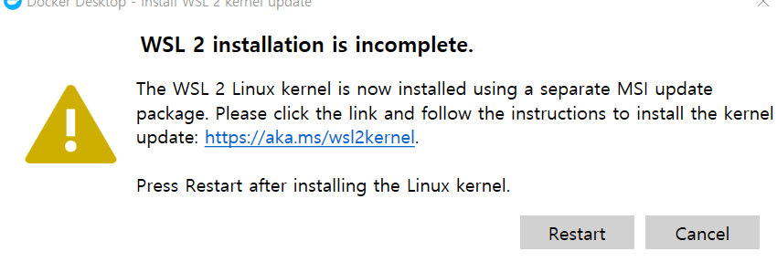

https://docs.microsoft.com/ko-kr/windows/wsl/install-win10#step-4---download-the-linux-kernel-update-package

위에서 wsl2를 설치!

4. wsl2를 설치 후에 위에서 Restart를 해야한다!!!!

5. restart를 누르고 아래와 같이 docker가 실행되면 된다!

   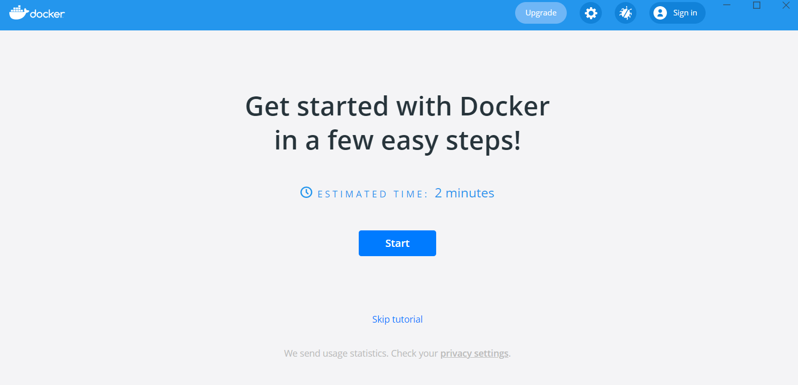

오른쪽에 시스템 트레이에 (시계오른쪽 말풍선모양) "docker is starting"이라는 메세지가 뜬다.


6. docker설치 확인법. cmd에 docker라고 쳤을때 아래와 같이 뜬다.

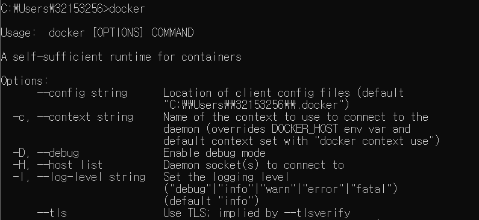


## ubuntu/centOS 설치

7. 우분투 실행하기

   ```bash
   docker run -it --name=ubuntu1 ubuntu
   ```

   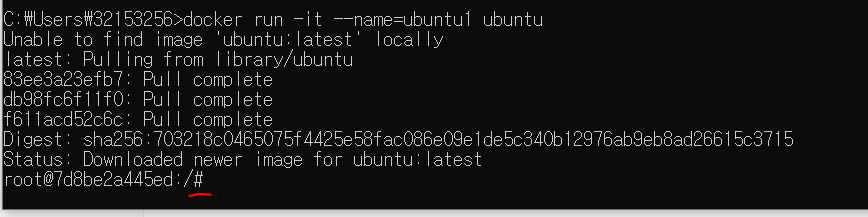

#이후 부터는 우분투 환경인것!


8. 우분투활용해보기

```bash
#리눅스 버전 확인
uname -a
#우분투 버전 확인
cat /etc/issue
```

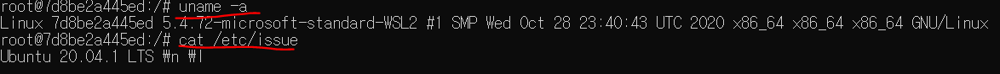


9. 컨테이너 탈출하는 법

=> ctrl을 누른상태에서 P와 Q를 연달아 누른다!


10. 다른 버전 우분투 띄우기(18.04버전)

```bash
docker run -it --name=ubuntu2 ubuntu:18.04
#위에서 ubuntu1에 접속했으므로!

uname -a
cat /etc/issue
#위의 명령어들로 확인할 수 있다!
```

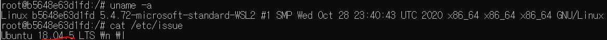


11. centOS 설치하기(설치하기전 ctrl+P+Q로 탈출!)

```bash
docker run -it --name=centos1 centos

#리눅스버전확인
uname -a
#centos버전확인
cat /etc/centos-release
```


## 리눅스에 mysql설치


1. mysql을 리눅스에 설치해보자!

```bash
docker run -d -p 3306:3306 -e MYSQL_ROOT_PASSWORD=ssong --name=mysql1 mysql
```

비밀번호는 내 mysql 비번을 쓰면됨!


앗! 3306은 윈도우에서 쓰고있는 포트번호라 충돌이 났다! 

3307포트로 다시 다운받자!

```bash
docker run -d -p 3307:3306 -e MYSQL_ROOT_PASSWORD=ssong --name=mysql2 mysql:5.7
```

위 명령어를 치면 방화벽설치문구가 뜬다! OK누르고 다음으로 넘어간다.

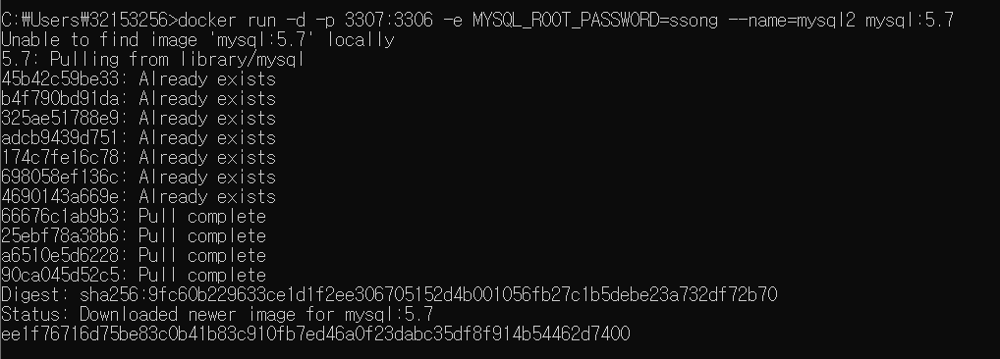

설치성공!


2. 컨테이너 접속

```bash
docker exec -it mysql2 bash
```


3. mysql접속

```bash
mysql -uroot -p
```

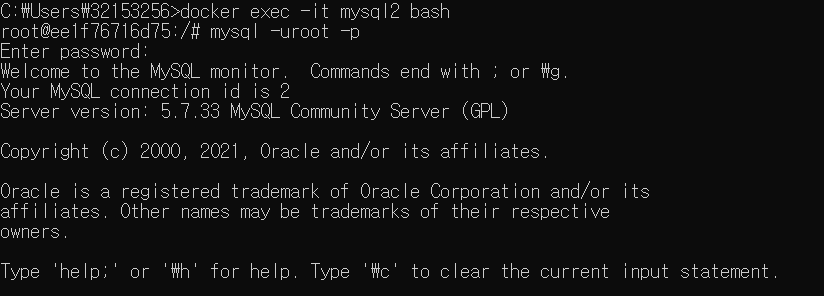


## 오픈소스기반 테스트 DB

https://launchpad.net/test-db

1. 위의 사이트에 가서 다운로드 2번째파일을 가져오기.


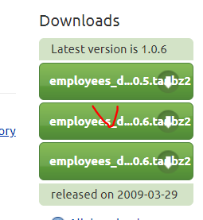

https://launchpad.net/test-db/employees-db-1/1.0.6/+download/employees_db-full-1.0.6.tar.bz2

2. 위의 두번째 다운로드 링크주소이다.


3. 순서대로 #상태에서 설치받기(가상머신상태)

```bash
apt update

apt install nano

apt install wget

apt install bzip2

#설치
wget https://launchpad.net/test-db/employees-db-1/1.0.6/+download/employees_db-full-1.0.6.tar.bz2

#압축해제
bzip2 -d employees_db-full-1.0.6.tar.bz2
tar xvf employees_db-full-1.0.6.tar

cd employees_db
ls
```


4. 해당 위치에서 mysql 접속하기

```bash
root@ee1f76716d75:/employees_db# mysql -uroot -p

#sql소스 복원하기
mysql>source employees.sql
```


## 트랜잭션 사용

1.트랜잭션을 쓰기 위한 준비

```bash
set autocommit=0;
```

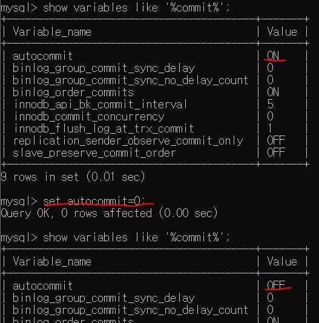


2. test 레코드를 하나 넣어보자.

```mysql
insert into employees values (100,'2000-1-1','Seokjae','Ha','M','2021-3-1');


CREATE TABLE `employees_new` (
  `emp_no` int(11) NOT NULL,
  `birth_date` date NOT NULL,
  `first_name` varchar(14) NOT NULL,
  `last_name` varchar(16) NOT NULL,
  `gender` enum('M','F') NOT NULL,
  `hire_date` date NOT NULL,
  PRIMARY KEY (`emp_no`),
  KEY `sample_index` (`first_name`,`last_name`)
) ENGINE=InnoDB DEFAULT CHARSET=latin1;
```


DML(레코드 CRUD)은 rollback 가능.

DDL(schema CRUD)은 rollback이 안된다.

따로 설정하지 않으면 **InnoDB**가 기본!

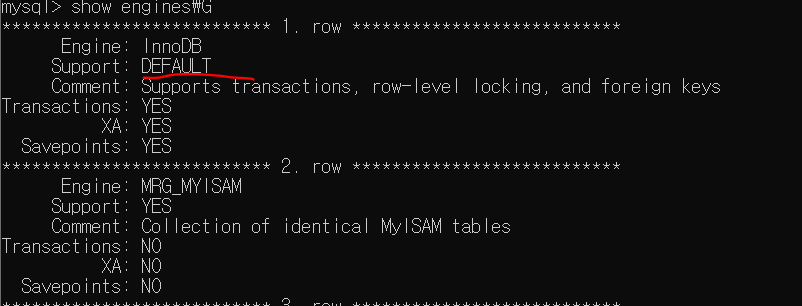


## MongoDB연결하기

```bash
#mongo받기
C:\Users\32153256>docker run -d -p 27017:27017 --name mongodb1 mongo
#실행
C:\Users\32153256>docker exec -it mongodb1 bash
#mongo실행
root@8ceef69aecb1:/# mongo
```

실행하고 나서 show dbs를 해보면 어제 docker에서 확인했던것과 같이 뜨는 것을 확인할 수 있다!

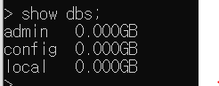


