# 도커 실행

위에서 만든 것이 mongodb1

위의 상태로 들어간다

```bash
#사용한 도커 상태확인가능
docker ps -a
#해당 도커 실행준비
docker start mongodb1
#해당 도커 시작!
docker exec -it mongodb1 bash

```


## 짜투리

자바도 기술적으로는 그 당시에 베스트여서 떴을뿐

웹표준을 지켜라 - ECMAscript(표준 자바 스크립트:ES9)

standalone javascript(Node.js) - 애플리케이션/서버

노드가 실행되기 위해선 자바스크립트 런타임이 필요

JRE(런타입+jvm) / JDK(compiler+런타임+jvm)


M/M(mans/month) - 공수

초급-중급-고급-특급


chromium

blink(Html엔진) / v8(Javascript엔진) cf. webkit(애플)


자바개발 환경폼

이클립스(IBM) /Netbeans(Sun/Oracle) / 인텔리제이(Jetbrains)


안드로이드 - 이클립스/안드로이드 스튜디오

OpenJava/ Kotlin(Jetbrains)


WSL2 / VSCode = 코드 에디터만 떼어놓은 것들


## 우분투에서 JAVA실행하기

1. 우분투로 도커만들기

```mysql
docker run -it --name=openjava1 ubuntu
```

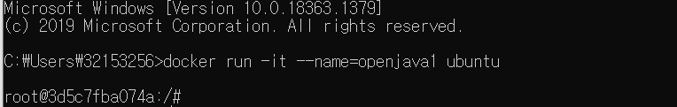

2. open jdk설치하기

```mysql
apt update
apt install nano
apt install openjdk-11-jdk
```

다운이 오래 걸린다....!


3. 시간대를 설정해준다

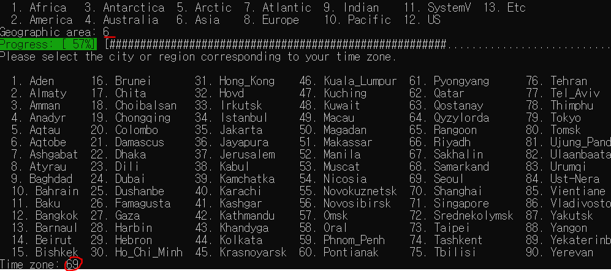


4. 환경변수를 설정하자!

- JAVA_HOME(자바 설치 위치)

/usr/lib/jvm/java-11-openjdk-amd64

cf. x86-64 (인텔) = amd64

- CLASSPATH(.class파일)

- PATH(javac/java)


```bash
export JAVA_HOME=/usr/lib/jvm/java-11-openjdk-amd64
export PATH=$JAVA_HOME/bin:$PATH
export CLASSPATH=$JAVA_HOME/lib/*:.
```

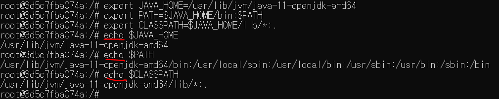

`echo`로 확인해본다.

```mysql
echo $JAVA_HOME
echo $CLASSPATH
echo $PATH
```


5. 샘플코드 만들어보기

```java
$ nano Sample.java


class Sample { 
	public static void main(String[] args) {
		System.out.println("Hello, Java !!!");
	}
}

ctrl+O (write) 치고 엔터
ctrl + X(exit)
```


6. 실행

```mysql
cat Sample.java로 제대로 들어갔는지 확인
javac Sample.java
ls #확인
java Sample 
```

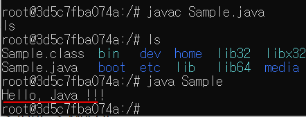


자바 (open java) - CLI -> JDBC -> MySQL

transaction/ preparedStatement


자바(open java) -> mongo(docker)


## 짜투리

- 환경변수(Environment V)

윈도우 탐색기-내PC우클릭 - 속성 - 고급시스템 설정 - 환경변수 클릭

프로세스(Process)마다 별도의 환경변수 영역을 가진다.

부모프로세스의 환경변수를 자식 프로세스가 복사

A(process) -> CreateProcess/Fork(실행) -> B


export SAMPLE=test

변수이름은 대문자

a=b에 빈칸이 있으면 안 됨. export SAMPLE = test(x)


### 우분투 환경변수 테스트

```mysql
docker run -it --name=ubuntu_new1 ubuntu
# export SAMPLE=test
# echo $SAMPLE
# env
환경변수상태 출력
```

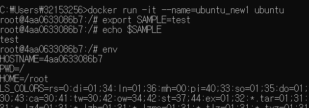


윈도우에서 환경변수를 보는 법 `set`

```mysql
set SAMPLE=test

echo %SAMPLE%
```

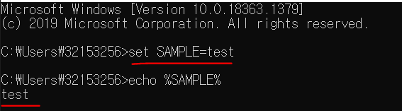


다른 cmd창을 켜서 echo를 확인하면 없다! 

=> 같은 cmd창에 cmd명령어를 치면 OS내에는 두개의 cmd창이 열린거다.

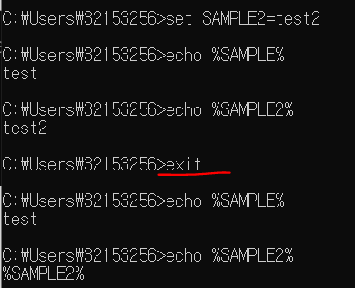

자식 cmd를 exit로 나가서 sample2가 저장 되지 않은 것을 확인할 수 있다.


## JDBC 드라이버 설치

> **unbuntu환경인 mariadb1 도커에서 진행**


1. mariaDB를 받아둔다.

```mysql
apt update
apt nano
apt install libmariadb-java

find / -name *.jar
```

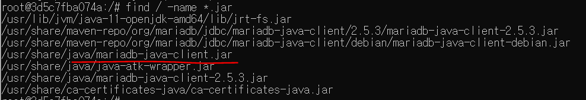

다운받은 것을 확인할 수 있다.


2. 환경변수 변경

```mysql
export CLASSPATH=$CLASSPATH:/usr/share/java/mariadb-java-client.jar
echo $CLASSPATH
```

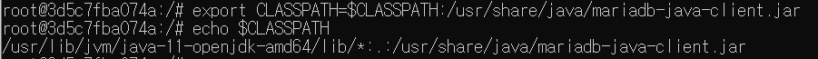

*JSP에서는 tomcat(CATALINA_HOME)의 lib 폴더에 직접 복사


3. ctrl+P+Q를 하면 나올 수 있다!


## JDBC연결

1. 도커 컨테이너 IP확인

```mysql
docker inspect mysql2
```

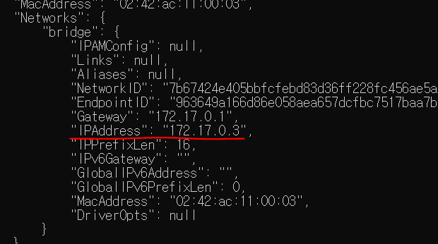


2. JDBC연결하기 위한 class파일 생성 (JavaDB.java로 저장)

```java
 
import java.sql.*;

 

class JavaDB {

    public static void main( String[] args ) {

        Connection conn = null ;

        Statement stmt = null;

 

        try {

            Class.forName( "org.mariadb.jdbc.Driver" );

        } catch( ClassNotFoundException e ){

                System.out.println(e.getMessage());

        }

 

        try {

            String url = "jdbc:mariadb://172.17.0.7:3308/employees";

            String userId = "root";

            String userPass = "bit" ;

 

            conn = DriverManager.getConnection(url, userId, userPass);

            stmt = conn.createStatement();

 

            ResultSet rs = null;

rs=stmt.executeQuery("select first_name from employees;");

            while (rs.next()) {
                System.out.println(rs.getString("first_name"));
            }
            stmt.close();
            conn.close();
        } catch( SQLException e ) {
            System.out.println( "SQLException : " + e.getMessage() ) ;
        }
    }
}

출처: https://whitememo.tistory.com/201 [White Memo]
```


Java Reflection  : JVM에서 실행되는 애플리케이션의 런타임 동작을 검사하거나 수정할 수 있는 기능이 필요한 프로그램에서 사용됩니다.

쉽게 말하자면, 클래스의 구조를 개발자가 확인할 수 있고, 값을 가져오거나 메소드를 호출하는데 사용됩니다.

Class

Object - 최상위 클래스. java.lang.Object(최상위), 모든 클래스들이 갖고있다. reflection을 갖고있다.

Method - 

Constructor

Modifier - 


3. 위를 저장하면 아래의 코드 실행 

```mysql
javac DBMS.java
java JavaDB

```

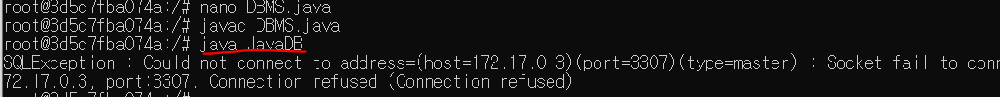

드라이버는 로딩됐으나 접속이 안되는 상황!


3-1. mariadb로 접속해보자(-e : 환경변수, 비밀번호 bit 로 설정했음) 

```mysql
docker run -d -p 3308:3306 -e MYSQL_ROOT_PASSWORD=bit --name=mariadb1 mariadb

docker exec -it mariadb1 bash
```

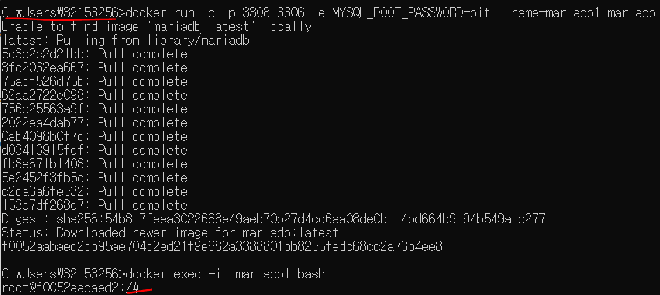


3.2 에러가 나는 것 같으니 mariaDB를 다시 설치해보자....MongoDB03.md에 저설정해둔거 따라서 해보기

```bash
apt update

apt install nano

apt install wget

apt install bzip2

#설치
wget https://launchpad.net/test-db/employees-db-1/1.0.6/+download/employees_db-full-1.0.6.tar.bz2

#압축해제
bzip2 -d employees_db-full-1.0.6.tar.bz2
tar xvf employees_db-full-1.0.6.tar

cd employees_db
ls

root@ee1f76716d75:/employees_db# mysql -uroot -p (비밀번호 bit)

#sql소스 복원하기
mysql>source employees.sql
```


4. docker접속

```bash
docker exec -it openjava1 bash
```


> 환경변수설정

```bash
export JAVA_HOME=/usr/lib/jvm/java-11-openjdk-amd64
export PATH=$JAVA_HOME/bin:$PATH
export CLASSPATH=$JAVA_HOME/lib/*:.
export CLASSPATH=$CLASSPATH:/usr/share/java/mariadb-java-client.jar
```


MySQL 8.0에서는 에러가 난다...! 인증 관련 변경

https://gmyankee.tistory.com/308


try-catch문으로 완성하기(참고블로그)

https://reiphiel.tistory.com/entry/jdbc-transaction-savepoints


## 해결


```bash
docker exec -it mariadb1 bash

apt update
apt install nano
nano /etc/mysql/my.cnf
#port:3306을 #지우고 port:3308로 맞춰준다


ctrl+O 엔터 후에 ctrl+X로 나오기
```

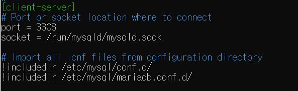

restart를 해줘야하지만 안되어서 ctrl+P+Q로 나온 뒤에

$상태에서

```bash
docker stop mariadb1
docker start mariadb1


docker exec -it openjava1 bash
#이 곳에 들어가서 환경변수 지정하기
```

환경변수 넣기

```bash
export JAVA_HOME=/usr/lib/jvm/java-11-openjdk-amd64
export PATH=$JAVA_HOME/bin:$PATH
export CLASSPATH=$JAVA_HOME/lib/*:.
export CLASSPATH=$CLASSPATH:/usr/share/java/mariadb-java-client.jar
```


SQLException 에러가 난다...왜지...?


## MongoDB를 도커에 설치

https://docs.mongodb.com/drivers/java/

> openjava1에서 생성!

```bash
apt install wget
wget http://dbschema.com/jdbc-drivers/MongoDbJdbcDriver.zip

apt install unzip

mkdir MongoDrv
cdMongoDrv
unzip MongoDbJdbcDriver.zip

cd..
export CLASSPATH=$CLASSPATH:/MongoDrv/*
```


환경변수설정

```bash
export JAVA_HOME=/usr/lib/jvm/java-11-openjdk-amd64
export PATH=$JAVA_HOME/bin:$PATH
export CLASSPATH=$JAVA_HOME/lib/*:.
export CLASSPATH=$CLASSPATH:/usr/share/java/mariadb-java-client.jar

export CLASSPATH=$CLASSPATH:/MongoDrv/*
```


MongoTest.java만들기

```bash
nano MongoTest.java
```


> MongoDB JAVA코드

```java
import java.util.List;
import java.util.Set;
import com.mongodb.DB;
import com.mongodb.MongoClient;
import com.mongodb.ServerAddress;
   
class Main {
    public static void main(String args[]){
        String MongoDB_IP = "172.17.0.2";
        int MongoDB_PORT = 27017;
        String DB_NAME = "testDB";
 
        //Connect to MongoDB
        MongoClient  mongoClient = new MongoClient(new ServerAddress(MongoDB_IP, MongoDB_PORT));
     
        //View Database List
        List<String> databases = mongoClient.getDatabaseNames();
    
        System.out.println("=====Database List===== ");
        int num =1 ;
        for (String dbName : databases) {
            System.out.println( num  + ". " + dbName);
            num++;
        }
      
        System.out.println();
     
        //Connect Database and Show Collection List in Database
        DB db = mongoClient.getDB(DB_NAME);
        Set<String> collections = db.getCollectionNames();
    
        System.out.println("Database : " + DB_NAME);
        for (String colName : collections) {
            System.out.println(" + Collection: " + colName);
        }
    }
}

삽입 후 Ctrl+O 엔터 Ctrl+X로 나온다!
출처: https://twinw.tistory.com/207 [흰고래의꿈]
```


---

IP 주소 확인하기

새로운 cmd창을 띄운다!

```bash
docker inspect mongodb1
```

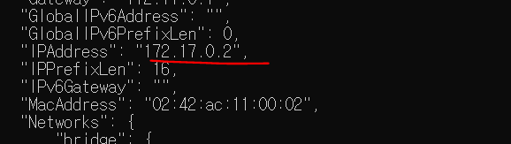

이 주소를 위의 MongoDB_IP에 채운다.(수정해놨음!)


후에 javac MongoTest.java로 실행해본다! >> 에러!!

import가 제대로 되지 않아서 에러가 난다!>>환경변수 문제! mongo환경변수를 추가해줬다!


### 해결

다른 cmd창에서 확인해보자.

```bash
docker ps -a
```

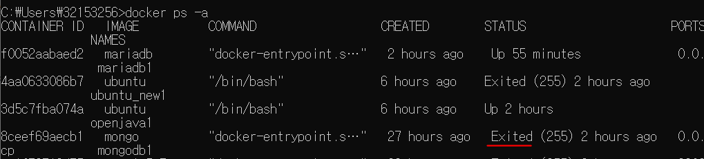

헉 mongo가 죽어있다!!!


mongodb1를 켜보자!

```mysql
docker start mongodb1

docker ps -a
몽고가 돌아가는 것을 확인!

docker exec -it mongodb1 bash
mongo
잘 돌아가고 있다! 버전도 잘 깔려있다!
```


다른 cmd창에서 docker 상태를 확인해 본다.

```mysql
docker inspect mongodb1
```

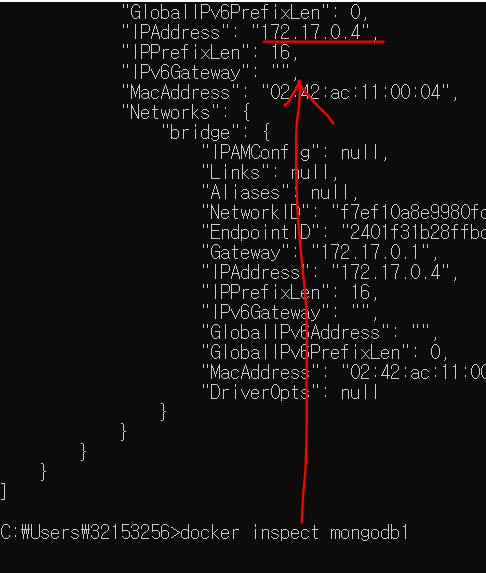

엥 아이피가 바꼈다!!!!!

다시 openjava1를 쓰던 cmd창으로 돌아가서 MongoTest.java의 ip주소를 바꿔준다. 수정한 뒤 다시 컴파일 하기.

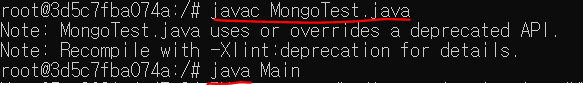


올바르게 성공한다면 아래와 같은 DB가 나온다! 어제 도커에 추가했었던 restaurants 콜렉션이 들어있는 것을 확인할 수 있다!

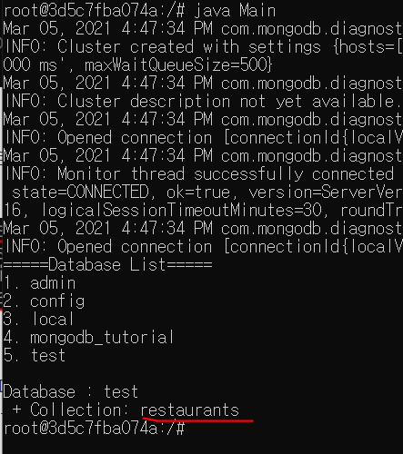


## 예제

http://semantics.kr/%ec%9e%90%eb%b0%94%ec%97%90%ec%84%9c-%eb%aa%bd%ea%b3%a0db%ec%97%90-%eb%ac%b8%ec%84%9c-%ec%a0%80%ec%9e%a5%ed%95%98%ea%b8%b0-insert-documents-in-mongodb-using-java/


2번과 3번해보기

시행전에 jar를 풀어줍니당

```bash
cd MongoDrv
jar xvf gson-2.8.6.jar

```

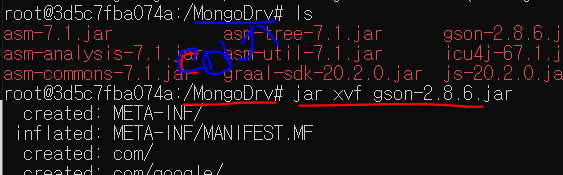

